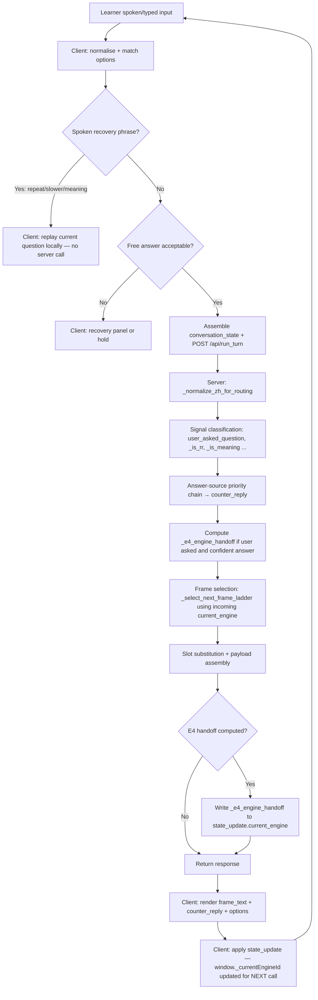

# MandarinOS Conversation Architecture

---

## 1. Purpose and scope

This document describes the conversation architecture of MandarinOS at baseline commit
`53584cee9e8c892ff77f12741d1fc89d9d09c7e7`, tagged `architecture-baseline-2026-07-12`.

It covers:

- how a learner utterance moves from spoken or typed input to a rendered partner response;
- which subsystems own which decisions;
- how topic engines, direct persona answers, recovery, and state interact;
- the invariants that future changes must preserve;
- safe extension points and known risks.

It deliberately leaves field-by-field state definitions to `STATE_CONTRACT.md` (not yet
created), detailed answer-source resolution rules to `ANSWER_SOURCE_CONTRACT.md` (not yet
created), and browser speech-recognition timing to `ASR_PIPELINE.md` (not yet created).

**MandarinOS is a conversation simulator, not a vocabulary drill or generic chatbot.**
The learner practises Mandarin by having a natural spoken or typed conversation with a
Chinese partner persona. The conversation itself is the principal unit of learner practice.
Every design decision in this document serves conversational coherence, learner initiative,
and Chinese–English fidelity before it serves any secondary concern.

---

## 2. Architectural objectives

The system is designed to achieve the following goals simultaneously:

**Sustain coherent conversation.** The partner's questions must feel like a genuine
unscripted exchange, not a fixed interview. The system selects questions that follow
naturally from what has just been said.

**Follow the learner's expressed topic or question.** When the learner asks the partner a
direct question, the partner answers it, and the engine is redirected so that the
*following* conversation move stays on that topic. Because the engine handoff takes effect
one response after the direct answer (see E4, Section 8), the immediate response may still
contain a frame from the previous engine; this one-response delay is an accepted baseline
characteristic.

**Maintain gentle topic-engine progression.** When the learner is not directing the topic,
the system advances through a soft-ordered sequence of conversation frames inside a topic
engine. Bridges to other engines are governed by per-engine preferred-target lists, not a
fixed global sequence. Progression is *guidance*, not a rigid script.

**Allow direct persona questions without losing continuity.** The learner may ask the
partner questions from their current topic domain or about the partner's own facts at any
point during the conversation. A direct question must receive a first-person persona answer
in `counter_reply`. The accompanying `frame_text` is selected from the incoming engine;
E4 ensures the engine is updated for the request that follows.

**Support recovery and clarification.** When the learner signals that they did not
understand, the system provides a recovery path (repeat, simplify, explain meaning).
Client-intercepted spoken recovery replays the current frame question without contacting
the server, preserving the learner's position. Server-side typed or unintercepted recovery
runs normal frame selection and may advance the ladder. This inconsistency — equivalent
recovery intentions producing different frame progression depending on the submission path
— is a known architectural characteristic, not a design goal.

**Suppress recently repeated answers.** When a persona answer has been used recently,
the system attempts to re-pick from the same-intent answer pool before falling back to a
topically appropriate acknowledgement. This is a recency-based suppression rule, not a
session-wide uniqueness guarantee; exhausted pools may produce a fallback phrase.

**Maintain Chinese, pinyin, and English synchronisation.** The three representations
displayed to the learner should describe the same answer. English and pinyin are derived
from the same Chinese text through a defined resolution path, not from a coarse intent
label.

**Keep answer selection, state progression, and UI presentation as logically distinct
concerns.** What the partner says, where the conversation is positioned, and how the UI
displays the result are coordinated through explicit data fields (counter_reply, frame_text,
state_update, current_engine) rather than through shared mutation.

Separation of genuine architectural objectives from feature details: the above are
objectives; the specific topic engines, persona profiles, and frame content are feature
details that can change independently.

---

## 3. End-to-end conversation flow

Each conversation turn follows this path from learner input to rendered response.

### 3.1 Numbered flow

1. **Spoken or typed learner input.** The learner speaks (via the browser SpeechRecognition
   API, language `zh-CN`) or types Chinese text. Spoken input produces a transcript in
   `ui/app.js:listenForResponse`. Typed or translated input is submitted by the learner
   directly.

2. **Client-side input normalisation and filler detection.** The client calls
   `normalizeConversationalFillers()` and `normalizeForMatch()` to strip leading discourse
   particles from the transcript before matching. `isIncompleteLearnerUtterance()` guards
   against premature submission of very short or filler-only text.

3. **Client-side option matching.** The client tries to match the transcript against the
   visible options using `matchTranscriptToOption()` (exact and partial-match).
   `classifyUnmatchedFreeAnswerDecision()` decides what to do when no option matches: accept
   the free answer, trigger recovery, or hold for another attempt.

4. **Client-side recovery interception (spoken path).** Before routing a spoken answer,
   `matchSpokenRecoveryPhraseExact()` checks whether the transcript is an exact recovery
   phrase (再说一遍, 慢一点说, 什么意思, etc.). When a match is found with action
   `repeat`, `slower`, or `meaning`, the client handles recovery entirely locally: it
   replays the current frame question without contacting the server. The frame does not
   advance. This is the primary recovery path for spoken input.

5. **Payload assembly and API call.** When the client determines an answer should be sent to
   the server, it assembles `conversation_state` (current engine, recent frame IDs, exchange
   counts, curiosity depth, last answer, recent persona replies, and approximately 40
   additional counters and flags) and posts to `/api/run_turn` with `next_question: true`.
   Frame-only loads (from the dropdown) send `frame_id` and `engine_id` instead.

6. **Server-side input normalisation.** The server calls `_normalize_zh_for_routing()`,
   which strips leading fillers via `_strip_leading_fillers()`, collapses inter-character
   CJK spaces (to handle ASR-spaced output like "西 安"), and strips trailing filler
   particles. The normalised text is used for routing; the original transcript is preserved
   separately for display and memory capture.

7. **Diagnostic capture (behaviour-free).** When `_diag_enabled()` returns True and the
   client provides a `diag_trace_id`, the server populates `_diag_cap` with routing signals.
   This never alters routing.

8. **Direction and probe fast-paths.** `direction_intent` values (reverse, why, mirror)
   and `probe_id` requests are handled before the main routing logic. They produce a
   short partner stub and return immediately without advancing the conversation ladder.

9. **Learner memory capture.** The server loads `learner_memory` (via `_lm_load`) for the
   current `learner_id` and applies any updates extracted from the previous turn's answer
   via `_capture_from_turn()`. Updated memory is written back via `_lm_save()`.

10. **Signal classification.** From the learner's answer, the server derives:
    `user_asked_question` (via `_is_user_question()`), `_responsive_food_answer`,
    `_is_meaning`, `_is_example`, `_is_rr` (repeat/slower request), `_lex_ct` (lexical
    definition), and whether the answer is a confusion signal or plain affirmation.

11. **Answer-source selection (`counter_reply` generation).** The server works through a
    priority-ordered chain to produce `counter_reply` — the partner's response to the
    learner's previous answer. See Section 9 for the full chain. This runs before frame
    selection and before E4 is resolved.

12. **E4 engine handoff computation.** When the learner asked a question and a confident
    non-generic answer was produced, the server computes `_e4_engine_handoff` using
    `_infer_question_topic_engine()` and `_QUESTION_TOPIC_TO_ENGINE`. This value is stored
    in a local variable; it does not yet affect frame selection.

13. **Frame selection.** The server selects the next conversation frame via
    `_select_next_frame_ladder()` or `_select_next_frame_bridge()`. The selector uses
    `current_engine` from the incoming `conversation_state` — not the E4 handoff value.
    The selector respects `_FRAME_ORDER`, `_FRAME_AFTER` dependencies, `skip_when`
    conditions, recent-frame deduplication, interest level, and session-arc state.

14. **Slot substitution.** Frame text tokens such as `{CITY}`, `{HOMETOWN}`, `{NAME}`, and
    `{ENTITY}` are resolved from learner memory, conversation state, and the entity
    follow-up chain (EFC). Unresolved tokens fall back to context-appropriate deictic
    Chinese (那儿, 你那儿, etc.) rather than surfacing the raw placeholder.

15. **Response payload assembly and E4 write.** The server assembles the response dict:
    `frame_text`, `frame_pinyin`, `frame_text_en` (the next frame question),
    `counter_reply`, `counter_reply_pinyin`, `counter_reply_en` (the partner's reply to
    this turn), `engine_id`, `frame_id`, `options`, and optional extras (turn_type, diag,
    discovery panel data). After assembly, if `_e4_engine_handoff` is set, it is written
    into `response["state_update"]["current_engine"]`. This is the first point at which E4
    affects any data — after frame selection is complete.

16. **Chinese–pinyin–English derivation.** `counter_reply_en` is derived from the final
    `counter_reply` Chinese text via `_persona_answer_en()`. `frame_text_en` comes from
    the frame record in `p2_frames.json`. The client receives these derived values and
    renders them; it does not independently translate or gloss these fields.

17. **Client state update.** The client applies `state_update` fields, including
    `current_engine` if E4 fired, to its local state (`window._currentEngineId`, etc.) and
    records the new frame in `window._recentFrameIds`. The updated engine value takes effect
    on the *next* call's `conversation_state`.

18. **Diagnostics flush.** If a `diag_trace_id` was used, `AsrDiag.complete()` joins the
    server-side `diag` payload to the client-side ASR trace and flushes it.

### 3.2 Mermaid flowchart

The following diagram represents the main conversational branching. Probe and direction
fast-paths are omitted for clarity. E4 is shown after frame selection to reflect its actual
execution order.



---

## 4. Conversation control layers

MandarinOS has the following major layers. Each is described by its authority over a
specific class of decision.

### 4.1 Browser / client interaction and submission-control layer (`ui/app.js`, ~10,700 lines)

**Authoritative for two distinct stages:**

*Stage 1 — capture and pre-routing control.* The client decides whether a spoken or typed
utterance is complete, whether it matches a visible option, whether it constitutes a
recovery phrase (intercepted locally before any server call), whether a free answer is
substantial enough to submit, and ultimately *whether and what* to send to the server. A
client decision at this stage can prevent the server from ever seeing the learner's original
utterance.

*Stage 2 — display and state maintenance.* After receiving a server response, the client
renders the partner's counter-reply and next question, maintains `window._currentEngineId`
and related state variables, and round-trips them in the next `conversation_state`.

**Does not own:** which engine is active in semantic terms (that is determined by the
server's frame selection and E4 handoff); what the partner says; which facts the persona
knows.

**Architectural risk:** A client-side decision — for example, intercepting a learner's
utterance as a recovery phrase when it was actually a new answer, or refusing to submit an
answer that the server would have routed correctly — prevents the server from correcting
the error. The client is a gatekeeper for the server, not a fallback.

**Current implementation characteristic (maintenance risk):** `ui/app.js` is approximately
10,700 lines containing all client-side logic including ASR handling, option rendering,
transcript management, card panel logic, progress display, and session management. This
concentration increases the risk of accidental coupling between unrelated concerns.

### 4.2 Server conversation coordinator (`scripts/ui_server.py`, ~12,600 lines)

**Authoritative for:** all semantic conversation routing decisions after submission; answer-
source selection; topic engine frame selection; E4 engine handoff; learner memory
persistence; persona answer derivation; slot substitution; diagnostics recording.

The server sees only what the client chooses to send. For spoken recovery phrases
intercepted client-side, no server call is made.

**Current implementation characteristic (maintenance risk):** `scripts/ui_server.py` is a
single Python file containing approximately 200 top-level functions and all server
conversation logic, from the HTTP handler through frame selection, answer-source chain,
memory management, and scorecard computation. This is the primary maintenance risk in the
codebase. Adding a new feature requires reading a large function body to understand context;
unintended interactions between branches are possible without full comprehension.

### 4.3 Question/topic inference layer (`_normalize_zh_for_routing`, `_is_user_question`, `_is_direct_persona_question`, `_infer_question_topic_engine`)

**Authoritative for:** classifying what the learner meant — answer, question, confusion,
recovery — and which engine/topic a question belongs to.

**Key contracts:** `_normalize_zh_for_routing` runs before any intent classifier;
`_is_user_question` is called on the normalised routing text, not the raw transcript.

### 4.4 Topic engines (`_FRAME_ORDER`, `_BRIDGE_TARGETS`, `_select_next_frame_ladder`, `_select_next_frame_bridge`)

**Authoritative for:** which frame is asked next within an engine; when and how to bridge
between engines; how to respect FRAME_ORDER soft ordering.

### 4.5 Answer-source mechanisms (`_direct_persona_answer`, `_find_mirror_answer`, `_answer_from_working_memory`, `_confusion_recovery_reply`, `_meaning_recovery_reply`)

**Authoritative for:** what the partner says in response to the learner's current turn.
These functions are called in a fixed priority order; each returns a `(zh, en)` tuple or
`None`.

### 4.6 Memory and state (`learner_memory.py`, `conversation_state`)

**Authoritative for:** what the system knows about the learner across sessions (learner
memory) and within the current session (conversation state). See Section 10.

### 4.7 Content / persona data (`personas/`, `content/recovery_phrases.json`, `p2_frames.json`)

**Authoritative for:** the actual Chinese sentences the persona says in narrative voice;
persona profile facts; recovery phrase options; frame text and options. Multiple persona
JSON files exist (e.g., `jianguo.json`, `xiaoming.json`, `zhang_wei.json`). The active
partner is selected by the learner via persona buttons; `window._partnerId` tracks the
selection and is included as `persona_id` in every API payload.

**Inline Chinese in production code:** Not all Chinese content lives in JSON files. The
baseline contains Chinese in several forms:

- *Routing and intent markers* (`_REPEAT_REQUEST_MARKERS`, `_SLOWER_REQUEST_MARKERS`,
  `_MEANING_REQUEST_MARKERS`, `_BARE_REPEAT_UTTERANCES`, regex patterns): Chinese directly
  in Python tuples and regexes. This is intentional: these are language patterns, not
  persona content.
- *City description maps* (`_CITY_LOCATION_BRIEF`, `_FEAT_POOL_INLINE`): brief factual
  descriptions of known cities, stored in code as dicts. Current implementation choice;
  these could be data-driven in future.
- *Closing reactions and small fallback phrases* (`_CLOSING_REACTIONS`,
  `_persona_limitation_reply`, `_soft_persona_fallback`): short system-level sentences.
  Maintenance risk: they are invisible to content editors.
- *Persona-specific narrative facts and voice lines*: these are in `personas/*.json`
  (`discoverable_facts`, `voice_lines`, `discoverable_facts_en`, `voice_lines_en`). The
  architectural preference is for substantial, persona-specific, learner-facing content to
  be data-driven so it can be updated without code changes.

The operational distinction is: language patterns and small system phrases may live in code;
substantial persona voice content and city-specific facts benefit from being in data files.

### 4.8 UI rendering (`renderOptions`, `renderSentenceOptions`, `renderRecoveryPanelInto`, `tokenizeHanziForOption`)

**Authoritative for:** producing the interactive `div.option-panel` elements with speaker
button, hint button, and clickable tokens. Learner-facing interactive response UI must use
these canonical builders.

### 4.9 Open-card affordance (`_stub_card_id`, `runtime/open_card_resolver.py`, `runtime/engine.py`)

In production, the server returns a `card_id` field in the response (computed by
`_stub_card_id(frame_id)`). The client's `renderFrameSentence()` dispatches `OPEN_CARD`
events and calls `resolveCard()` to fetch card content from
`tools/cards/out/cards_by_id.json`. This is a client-side affordance backed by server data.

The `runtime/engine.py` pipeline (`process_turn()`) is a test infrastructure component
used to verify the card resolution contract (`TURN_START` → `OPEN_CARD` → `TURN_END`). It
is not called from the normal production turn handler. It exists so that the boundary
between card resolution and the conversation engine can be tested without a live server.

### 4.10 Diagnostics (`_diag_enabled`, `_diag_append`, `_diag_finalize_response`, `AsrDiag`)

**Authoritative for:** capturing routing signals without altering conversation behaviour.
Diagnostics are gated by `_diag_enabled()` and must not change a routing outcome.

---

## 5. Topic engines and ladder progression

### 5.1 What an engine represents

A topic engine is a named conversational domain. Within each engine, the partner normally
invites the learner to talk about that area of their own life: where they are from, what
they do for work, what they enjoy. The partner's persona facts for that domain supply the
content for direct-answer and reciprocal turns. Engines are not monologues by the persona;
they are structured opportunities for the learner to speak.

The baseline engines are:

| Engine | Conversational purpose | Typical `_FRAME_ORDER` progression |
|--------|------------------------|------------------------------------|
| identity | Name, nickname, age | name → friends call → family call → name story → age |
| place | Origin, current city, local features and food | origin → current city → distance → special → food → distance-time → hometown → travel bridge → live-with → why-live |
| work | Occupation, company, tenure | what work → company → duration → location → origin story → future → why quit |
| hobby | Leisure activities | open → location → best part → origin → social → travel |
| travel | Past travel, destinations | where been → best trip → special → food → who with → purpose |
| food | Food preferences, local dishes | available → famous → taste |
| family | Living arrangement, relationships, marriage | live together → closest → activity → married → children |
| life | General lifestyle (no frames defined in baseline) | — |

### 5.2 `_FRAME_ORDER` is a soft preference, not a rigid script

`_FRAME_ORDER` lists the preferred sequence of frame IDs per engine. The selector respects
this order but can skip frames whose `_FRAME_AFTER` dependencies are not yet satisfied,
whose `skip_when` conditions are met, or which have already been used in `recent_frame_ids`.

### 5.3 Bridge engine order is not a global sequence

The list `identity → place → work → hobby → travel → food → family` commonly appears as a
progression in practice, but it is not a code-defined global ordering. Engine-to-engine
transitions are governed by `_BRIDGE_TARGETS`, a per-engine dict of preferred next engines:

```
identity → [place, family, work, hobby]
place    → [food, family, work, travel, hobby, identity]
work     → [family, identity, place, hobby]
hobby    → [family, work, identity, travel, food]
travel   → [family, work, identity, place, hobby, food]
food     → [family, work, place, travel, hobby, life]
```

A separate `_RECOVERY_BRIDGE_ENGINE_ORDER` governs bridges triggered by the learner's
explicit confusion or change-of-topic signal. Learner-seeded disclosures (`seeded_bridge_engines`)
can override either order, making bridges follow the conversational thread rather than a
static list.

### 5.4 How the current position is retained

The client maintains `window._currentEngineId` and `window._recentFrameIds`. These are
included in every `conversation_state` payload. The server reads `cs["current_engine"]` and
`cs["recent_frame_ids"]` to determine where the conversation is positioned before selecting
the next frame.

For the first turn of a session, `window._currentEngineId` is null; the client falls back
to the engine associated with the selected dropdown frame, then to `"identity"`. It is set
from server responses for all subsequent turns.

### 5.5 Learner initiative and engine redirection

When the learner asks a direct question and E4 fires (Section 8), the server writes a
different engine into `state_update.current_engine`. The client applies this after the
current response is rendered.

**One-response delay:** the frame packaged with the direct persona answer is selected from
the *incoming* engine, before E4 is written. The redirected engine first takes effect on the
request that follows. This means one transitional frame from the previous engine may appear
between the learner's question and the first frame from the topic the learner asked about.
E4 prevents continued reversion after that transitional response but does not eliminate the
immediate mismatch.

### 5.6 Bridge transitions

`_select_next_frame_bridge()` fires when the current engine has no remaining frames or the
session arc state (`loop_count_in_current_engine >= LOOP_COUNT_IN_ENGINE_SOFT_CAP`)
suggests the engine is exhausted. The bridge selects from `_BRIDGE_TARGETS`, modified by
seeded engine preferences and engines already visited.

### 5.7 Frame selector fallback

When no suitable frame can be found in any engine, the server returns a 400 error ("no
frame available for next question"). In practice, the closing-move logic fires first when
the session has run long, ending the conversation with a natural statement before exhaustion
is reached.

---

## 6. Learner initiative and question handling

MandarinOS distinguishes the following input types. The distinction is made primarily in
`scripts/ui_server.py` on the normalised routing text.

**Answer to the persona's question.** The default interpretation: the learner's text is
treated as content for the current frame. `user_asked_question` is `False`; the answer
is processed for memory capture and topic continuation.

**Learner asking the persona a direct question** (`_is_direct_persona_question`). The
learner is asking a specific fact about the partner (你是哪里人？ 你做什么工作？). This
sets `user_asked_question = True`. The server routes to `_direct_persona_answer()` or the
mirror bank.

**Reverse question** (`_detect_reverse_fact_intent`). The learner asks a question that
mirrors a topic just discussed (e.g., the persona just revealed its hometown and the learner
asks "你那里有什么好吃的？"). The server uses `_reverse_fact_answer()` to answer from the
persona's discoverable facts.

**Learner introducing a new topic** (`_is_explicit_topic_switch`, `_has_volunteered_travel_intent`). The learner volunteers information about their own travel, food, or other
topic that has not been asked about yet. The server acknowledges with an empathetic or
follow-up reply.

**Recovery request** (`_is_rr`, `_is_meaning`, confusion signal). The learner signals they
did not understand. The handling depends on whether the request was intercepted client-side
or reached the server. Detailed in Section 12.

**Short acknowledgement** (`_is_plain_affirmation`). The learner says 对, 嗯, 是的, etc.
These clear confusion counters but do not trigger topic change.

**Ambiguous utterance.** When none of the above classifiers fire, the utterance is treated
as a content answer. The system is intentionally permissive: ambiguous input is better
received as an imperfect answer than rejected.

**Open-world location input** (`_extract_open_world_location`,
`_is_unscripted_substantive_answer`). When the learner mentions a place name not in
`_CITY_LOCATION_BRIEF`, `_extract_open_world_location()` tries to extract a structurally
extracted location value using patterns such as 我现在住在X and 我住在X. When it succeeds,
the accepted learner-supplied location is stored in `learner_memory["lives_in"]` or
`learner_memory["hometown"]` and can be used in later slot substitution. For general
unscripted answers, `_is_unscripted_substantive_answer()` checks whether the answer is
non-trivially Chinese so it can be accepted as a content contribution. The system does not
automatically understand, look up, or answer questions about arbitrary unknown entities;
it extracts only structurally recognisable location values.

### 6.1 Question-focus precedence

**Architectural contract:** the grammatical focus of a learner's question must not be
displaced merely because another recognised entity appears earlier in the utterance.

This is enforced by `_place_from_question_context()` in `scripts/ui_server.py`. The
function uses `_CITY_BEFORE_QUESTION_MARKER_RE`, a regex that matches a city token
*immediately preceding* a feature or food question marker. This city takes priority over
any other city found earlier in the utterance via `_context_city_from_text()`.

**Illustrative example.** The learner says "我不喜欢上海，成都有什么特别？". The
utterance contains 上海 before 成都. Without the question-focus rule, the system might
answer with a Shanghai fact. The regex matches 成都 immediately before 有什么特别, so
成都 is the resolved subject and the answer is about Chengdu. Confirmed by
`test_conversation_first_wave.py::test_city_routing_prefers_question_focus`.

---

## 7. Direct persona answers

### 7.1 When the direct path is invoked

`_direct_persona_answer()` is called when the learner's utterance is classified as a direct
question to the partner (`_is_direct_persona_question()` returns True, or the utterance
matches specific place-feature or place-food patterns). It is also called from the stale-counter-reply override path and the explicit-place-topic block in the priority chain.

### 7.2 How question intent is inferred

The function `_direct_persona_answer(t, persona, recent_replies)` works by sequential
pattern matching on normalised text `t`. Patterns are ordered by specificity: longer or
more specific patterns are checked first to prevent shorter patterns from swallowing them.
For example, "你的名字有什么意思" is checked before "你的名字" to ensure the meaning
question is not mis-routed as a generic name question.

### 7.3 How persona facts are selected

The partner persona is loaded from `personas/<id>.json` by `_resolve_persona()`. The
function reads from:

- `persona["profile"]` — structured fields (city, hometown, age, occupation, etc.);
- `persona["voice_lines"]` — short first-person statements by topic;
- `persona["discoverable_facts"]` — longer narrative facts keyed by topic ID;
- `persona["distance_profile"]` — structured distance facts.

For most pattern branches, the function assembles a first-person Chinese response from
persona JSON data. Some branches also contain inline Chinese fallbacks (e.g., "我老家在中国。")
for cases where no persona fact is available. These inline fallbacks are a maintenance
risk: they are not persona-specific and are not visible to content editors.

### 7.4 How direct answers differ from ordinary ladder replies

An ordinary ladder reply is a frame selected from `p2_frames.json`: the partner *asks*
the learner a question. A direct persona answer is the partner *responding* to the learner's
question about the partner. The direct answer appears in `counter_reply`, not in
`frame_text`. The two fields are assembled and returned independently in the same response.

### 7.5 Dynamic facts and predefined voice lines

When a specific fact is available in `persona["discoverable_facts"]`, the dynamic fact is
used. When no specific fact exists, the function falls back to the matching entry in
`persona["voice_lines"]`, which is a shorter general statement. When neither exists, a
generic fallback is produced. This three-level fallback is an architectural pattern:
specificity first, voice line second, generic last.

### 7.6 How unsupported questions are handled

`_topic_aware_honest_fallback()` returns a topic-appropriate honest acknowledgement for
questions the persona cannot specifically answer. `_persona_limitation_reply()` handles
genuinely out-of-scope questions. The system avoids the generic "computer character"
disclaimer when a topic-appropriate response is available.

### 7.7 Reconnecting to conversational progression

After a direct persona answer, the next frame is selected by the normal frame selector
using the engine from the incoming `conversation_state`. If E4 computed a handoff, that
engine takes effect on the *following* call, not the current one.

---

## 8. E4 topic handoff

### 8.1 What E4 solves and what it does not

When a learner asks the partner a direct question, the partner answers it in `counter_reply`.
The `frame_text` in that same response is selected using the *incoming* `current_engine`,
because frame selection runs before E4 writes its result. This means the response that
carries the direct persona answer also carries a frame question from the engine that was
active *before* the learner asked. Without E4, every subsequent request would continue from
the old engine indefinitely, making the redirect invisible beyond that one turn.

E4 (internal label: "Initiative Follow") solves the multi-turn problem by writing the
redirected engine into `state_update.current_engine`. The client applies this after the
response arrives. The *next* call then carries the updated engine in `conversation_state`.

**What E4 does not solve:** it does not eliminate the one-response transitional frame from
the previous engine. The baseline therefore accepts a one-frame delay between a learner's
topic redirection and the conversation moving fully into the redirected topic. This is a
known architectural characteristic, not an error.

"E4" is an internal label, not a class or file. It refers to the initiative-follow block
in the `/api/run_turn` handler.

### 8.2 Exact timing

E4 timing is unambiguous: it operates in two separate phases within a single response
cycle.

**Phase 1 — computation (before frame selection).** Around line 10296 of `ui_server.py`,
the handler computes `_e4_engine_handoff` using `_QUESTION_TOPIC_TO_ENGINE` or
`_infer_question_topic_engine()`. The result is stored in a local variable.

**Phase 2 — write (after frame selection and payload assembly).** After all frame selection
is complete and the response dict is assembled, the handler writes the handoff at line
11833: `response["state_update"]["current_engine"] = _e4_engine_handoff`. This is the
first time E4 affects any data structure.

**Consequence:** E4 does *not* affect the frame returned in the same `/api/run_turn`
response. The frame is selected using the engine from the incoming `conversation_state`.
E4 only affects the following request, after the client applies `state_update.current_engine`
to `window._currentEngineId`.

### 8.3 Triggering conditions

E4 fires when all of the following are true:

1. The learner asked a question (`user_asked_question = True`).
2. A confident non-generic answer was produced (`_counter_result` is not None).
3. The answer came via one of the three supported paths:
   - **Mirror bank** (`_counter_is_new_mirror = True`): the question matched a known mirror
     topic with a `topic` field;
   - **Working memory** (`_counter_is_working_memory = True`): the answer came from recent
     persona replies via `_answer_from_working_memory()`;
   - **Direct persona / static fact**: the answer came from `_direct_persona_answer()` and
     the resulting text is not in the generic deflection phrase set.

E4 does not fire when: the learner made a statement (not a question); `_counter_result` is
None; the answer is a generic deflection; the question could not be classified by
`_infer_question_topic_engine()` (returns None).

### 8.4 Which fields carry the handoff

Server-side: `response["state_update"]["current_engine"]` (a string engine name, e.g.
`"travel"`).

Client-side: `window._currentEngineId = data.state_update.current_engine` (applied in
`_runTurnInner` after receiving the response).

The updated value is included in the *next* `conversation_state.current_engine`.

### 8.5 What state it changes and must preserve

E4 changes only `current_engine` in `state_update`. It does not touch `recent_frame_ids`,
`recent_persona_replies`, learner memory, or any counter. The conversation history is
preserved.

### 8.6 What would break without E4

Without E4, the engine redirect would last for exactly one turn: the learner's question
would be answered in `counter_reply`, but every subsequent frame would continue from the
previous engine as if the question had never been asked. E4 ensures the redirect persists
beyond the transitional response. With E4 in place, there is still a one-response frame
from the old engine (because E4 is written after frame selection); without E4, that
one-frame gap becomes permanent.

---

## 9. Answer generation versus conversation progression

### 9.1 The separation

The server response contains two structurally separate parts:

- **`counter_reply` / `counter_reply_pinyin` / `counter_reply_en`**: what the partner says
  *in response to the learner's current answer*. Generated from the answer-source priority
  chain.

- **`frame_text` / `frame_pinyin` / `frame_text_en` / `options`**: the partner's *next
  question or statement*. Selected by the frame selector independently.

These two concerns are handled by separate code paths and separate data sources. They are
coordinated through shared data — particularly the E4 handoff, `state_update`, `current_engine`,
and the answer-source result — but they are not generated from the same variables and
changes to one path do not automatically change the other.

The separation is an architectural goal, not a guarantee of complete independence: the
priority chain result informs whether E4 fires, which in turn informs the engine used on
the *next* call's frame selection. A developer modifying the counter-reply chain should
check whether E4 triggering conditions are affected.

### 9.2 The answer-source priority chain

The following chain is executed in order; the first non-None result becomes `counter_reply`.

1. **Frustration / insult signal** → `_frustration_repair_reply()` (social repair, no
   positive acknowledgement).
2. **Learner disclosure** (health or concern situation) → `_disclosure_empathy_reply()`.
3. **Persona challenge** (learner tests the persona's Chinese knowledge) →
   `_persona_challenge_reply()`.
4. **Responsive food answer** (declarative food-list reply to a preceding place-food
   question) → `_food_responsive_reply()`.
5. **Volunteered travel intent** (learner announces travel plans) →
   `_travel_intent_followup()`.
6. **Explicit place-topic** (learner asked a feature or food question about a named place)
   → `_direct_persona_answer()` with the place question.
7. **Meaning request** (`_is_meaning`) → `_meaning_recovery_reply()`.
8. **Example request** (`_is_example`) → `_clarify_app_question()`.
9. **Repeat / slower request** (`_is_rr`) → `_clarify_app_question()`.
10. **Lexical definition** (`_lex_ct`) → `_lexical_definition_reply()`.
11. **Stale counter-reply override** (fresh direct persona question after a previous
    counter-reply exists) → `_direct_persona_answer()` called directly.
12. **Mirror confusion escalation** (confusion signal on an active mirror topic):
    - Stage 1 → `_mirror_restate_naturally()`;
    - Stage 2 → `_mirror_persona_stub_simple()`;
    - Stage 3+ → `_confusion_recovery_reply()`.
13. **App-question confusion** (confusion signal with no prior counter-reply) →
    `_clarify_app_question()`.
14. **Noisy location answer** (location frame, answer looks garbled) → flag only;
    frame-text override applied later in post-assembly.
15. **Pending-frame commitment** (off-topic answer to a commitment frame) →
    `_clarify_app_question()`.
16. **Adjacency guard** (learner asks "why do you like X?" when a mirror engine is active)
    → voice line fragment.
17. **E3 working memory** (learner asked a question; recent persona replies contain the
    relevant fact) → `_answer_from_working_memory()`.
18. **Mirror bank + general answer** → `_answer_user_question_prefix()` which calls
    `_find_mirror_answer()` then `_direct_persona_answer()`.
19. **`None`** — no counter-reply this turn.

### 9.3 `frame_id` and ladder position

`frame_id` identifies the frame selected as the next question. It is included in the
response so the client can update `window._lastPartnerFrameId` and append it to
`window._recentFrameIds`. These values are essential for deduplication in subsequent calls.

### 9.4 Relationship to `ANSWER_SOURCE_CONTRACT.md`

The full field-by-field definition of how each answer-source path constructs its `(zh, en)`
tuple is left to `ANSWER_SOURCE_CONTRACT.md` (not yet created). This document establishes
the boundary: `counter_reply` and `frame_text` are separate responsibilities, coordinated
through explicit data rather than shared mutable state.

---

## 10. Memory and conversational context

MandarinOS maintains four distinct context scopes.

### 10.1 Immediate turn context

Information computed from the current request payload: the answer text, normalised routing
text, inferred intent flags. These are local variables computed fresh each turn from
`payload`. They are not stored in session state or learner memory. However, derived facts
(e.g., `slot_names` indicating a CITY slot was answered) do feed into learner memory
capture and session state updates within the same turn.

### 10.2 Working memory (`recent_persona_replies`, `last_counter_reply`, `last_partner_frame_text`)

Working memory is a short list (up to five entries) of recent partner replies, maintained
as `cs["recent_persona_replies"]` in `conversation_state`. It is read on each turn to:

- provide context for `_answer_from_working_memory()` (E3);
- suppress exact-repeat persona answers in the deduplication guard;
- support confusion escalation (mirror confusion ladder).

Working memory is client-maintained (included in `conversation_state`) and server-read.
It is cleared on `_resetCurrentSessionState()` and does not survive across sessions.

### 10.3 Persistent learner memory (`learner_memory.py`)

The server stores six learner facts keyed by `learner_id`:

- `learner_name` — the learner's own name;
- `hometown` — where the learner is from;
- `lives_in` — where the learner currently lives;
- `job_or_study` — what the learner does;
- `family` — family situation;
- `favourite_food` — preferred food.

These facts are captured automatically from learner answers by `_capture_from_turn()` and
persisted by `_lm_save()`.

**Persistence path:** the default storage location is `data/learner_memory.json` (relative
to the repository root), keyed by `learner_id`. The path is configurable via the
`MANDARINOS_DATA_DIR` environment variable. In Railway deployments, the actual storage
location is determined by the mounted volume path provided through this variable, not by
the in-repo `data/` directory. The architectural contract is that the server is authoritative
for learner memory and the client never sends learner_memory in its payload; the specific
file path is an operational detail.

**Reset:** `startFreshLearner()` calls `/api/reset_memory` to clear server-side facts for
the current `learner_id`. Progress snapshots are not affected.

**Architectural distinction:** working memory is short-lived context for conversational
follow-up; learner memory is a persistent biographical profile used to personalise frame
text. They must not be conflated.

### 10.4 Persona facts (`personas/<id>.json`)

The partner persona's facts are static JSON: `profile`, `voice_lines`, `discoverable_facts`,
`discoverable_facts_en`, `voice_lines_en`, and `distance_profile`. These are loaded at
request time by `_resolve_persona()`. They are the partner's side of the conversation; they
are not learner data.

### 10.5 Current topic / engine state

`conversation_state` carries `current_engine`, `loop_count_in_current_engine`,
`engines_visited`, `seeded_bridge_engines`, and related fields tracking where the
conversation is in its arc. These are client-maintained and server-read; the server updates
them in `state_update`.

### 10.6 Examples

| Scope | Example fact | Lifetime |
|-------|-------------|---------|
| Immediate turn | Learner said "我住在成都" (routing text) | One turn only |
| Working memory | Partner said "我去过西藏" three turns ago | Current session |
| Learner memory | Learner's hometown is Dunedin | All future sessions |
| Persona facts | Jianguo's favourite food is 麻婆豆腐 | Static; changed by editing the JSON |
| Engine state | Current engine is "travel" | Current session; updated by E4 or bridge |

---

## 11. Repetition, deduplication, and stale-answer prevention

### 11.1 Reply-text deduplication

Before returning a `counter_reply`, the server checks whether the candidate text (or its
bare form after stripping the discourse prefix "我呢，") appears in `recent_persona_replies`
(recent-turn recency window) or matches `last_counter_reply`. This check suppresses recently
used replies; it is not a session-wide uniqueness guarantee.

If the candidate is stale, `_dedupe_persona_answer()` attempts to re-pick from the
*same-intent answer pool* (e.g., another feature fact for the same city). Only when that
pool is exhausted does it fall back to a topically appropriate clarification phrase. It
does not select from a different intent's pool as the first fallback, because doing so
would produce an answer about a different city or topic than the one asked.

### 11.2 Semantic stale-answer detection and answer-pool re-selection

The place-feature and place-food answer pools (`_FEAT_POOL_INLINE`, food pool) contain
multiple alternative answers per city. When the first answer is stale, the system cycles
through alternatives before giving up. Tests: `test_stale_answer_loop_regression.py`,
`test_stale_counter_reply_loop.py`.

### 11.3 Stale counter-reply override

The stale-counter-reply override (priority chain step 11) prevents a prior place or city
answer from being recycled when the learner asks a different direct question. The guard
calls `_direct_persona_answer()` directly for fresh direct questions, bypassing the mirror
path's keyword-matching which can recycle earlier answers.

### 11.4 Fallback and deduplication paths must preserve translation contracts

When `_dedupe_persona_answer()` selects an alternative, `_persona_answer_en()` is called on
the alternative Chinese text. The English corresponds to the alternative selected, not the
original stale answer. Enforcement: `_persona_answer_en()` called on `_deduped` at the
dedup guard's substitution point.

### 11.5 Chinese–English synchronisation

**Intended contract:** `counter_reply_en` should be derived from the final `counter_reply`
Chinese text via `_persona_answer_en()`, not from a coarse intent label. The resolution
order in `_persona_answer_en()` is: deflection-phrase map, voice_lines_en,
reverse-fact English, discoverable_facts_en, phrase-bank.

This was introduced after a regression (first-bad commit `0177994`) where
`_reverse_fact_answer_en()` returned English for the wrong subject. Tests:
`test_zh_en_synchronisation.py` covers the deduplication path regression.

**Known limitation:** not every code path that produces a `counter_reply` is equally well
tested for synchronisation. Paths that construct Chinese dynamically (e.g.,
`_persona_limitation_reply`, `_soft_persona_fallback`) return English via `_persona_answer_en`'s
phrase-bank lookup, which may return `""` if the phrase is not in the map.

---

## 12. Recovery as part of conversation

Recovery is a first-class conversation capability, not an error state. When the learner
does not understand, the system provides repair. The behaviour differs by path.

### 12.1 Two recovery paths with different frame outcomes

**Path A — Client spoken interception (primary path for spoken input).**

When a spoken transcript matches a recovery phrase via `matchSpokenRecoveryPhraseExact()`
with action `repeat`, `slower`, or `meaning`, the client handles recovery entirely locally:

- It adds the learner's phrase to the transcript.
- It replays the current frame question (with slower TTS rate for `slower`).
- It does *not* contact the server.
- The `frame_id`, `frame_text`, and ladder position do not change.
- The next regular turn continues from the same frame.

This is the primary recovery path. It gives the learner what they asked for (a repeat or
slower version of the current question) without consuming a server turn.

**Path B — Server-side `_is_rr` / `_is_meaning` (fallback path).**

When a recovery-like text reaches the server — because it was typed rather than spoken, or
because it was not matched by the client interceptor — the server classifies it via
`_is_rr`, `_is_meaning`, or `_is_example`. The handling is:

- `counter_reply` is set to a rephrase of the previous frame question
  (via `_clarify_app_question()` or `_meaning_recovery_reply()`).
- Normal frame selection runs and picks a new frame from the ladder.
- `frame_text` is a new question, not a repeat of the previous one.

**Consequence:** In Path B, the ladder *does* advance. The rephrase appears in
`counter_reply`; the learner then faces a new frame question.

### 12.2 Confusion escalation

When the learner signals confusion (not a specific recovery phrase) while a mirror answer
is active, the mirror confusion escalation ladder fires:
- Stage 1: `_mirror_restate_naturally()` — natural restatement.
- Stage 2: `_mirror_persona_stub_simple()` — simplified version.
- Stage 3+: `_confusion_recovery_reply()` — generic recovery.

Normal frame selection runs after each of these. The frame advances.

When the learner signals confusion about the partner's frame question (no active mirror),
`_clarify_app_question()` is used for `counter_reply` and normal frame selection runs.

### 12.3 Noisy location clarification (frame override)

When the learner's answer to a location frame looks garbled (`_noisy_location_clarify`),
the server overrides `frame_text` and `frame_id` in the post-assembly phase to repeat the
location frame at the appropriate escalation level (rephrase → natural re-ask → gentle
move-on). This is one of the few cases where frame selection output is explicitly
overridden. The ladder does not advance until the location answer is accepted.

### 12.4 Recovery phrases

The canonical learner-side recovery phrases are defined in `content/recovery_phrases.json`
(schema version 1.3). Each phrase has an `id`, `hanzi`, `pinyin`, `text_en`, `repair_kind`
(soft_hold, repeat, meaning, etc.), and `move_type` (REPAIR). The client displays these
phrases in the recovery panel so the learner can tap a phrase without producing it from
memory.

### 12.5 Challenge mode

In challenge mode, the default hint buttons and recovery panel are hidden. Spoken recovery
phrases are still intercepted by `matchSpokenRecoveryPhraseExact()` (Path A above). The
server's recovery routing is unchanged in challenge mode.

### 12.6 Recovery and topic routing

Recovery classification (steps 7–9 in the priority chain) runs before the mirror bank and
general direct-answer paths (steps 11–18). When a recovery text reaches the server via
Path B, the recovery handler produces `counter_reply` and returns — the mirror bank and
later answer sources are not consulted for that `counter_reply`. Normal frame selection
still runs after the counter_reply is determined, so the ladder can advance even though
the counter_reply is a rephrase rather than a new persona answer.

---

## 13. Client/server boundary

### 13.1 Decisions owned by the client (`ui/app.js`)

- Whether a spoken utterance is complete enough to send.
- Whether a transcript matches a visible option.
- Whether the transcript is a spoken recovery phrase (intercept, no server call).
- Whether a free answer is acceptable (`classifyUnmatchedFreeAnswerDecision`).
- How to render partner statements, options, recovery panels, and the transcript.
- Maintaining `conversation_state` and all `window._*` variables.
- TTS playback and listening state.
- Session start, reset, and learner ID management.
- Selecting the active persona (`window._partnerId`) via persona buttons.

### 13.2 Decisions owned by the server (`scripts/ui_server.py`) — after submission

- All semantic conversation routing decisions.
- Topic engine and frame selection.
- E4 engine handoff.
- Persona fact retrieval and first-person answer generation.
- Learner memory persistence.
- Slot substitution.
- Chinese–pinyin–English derivation.
- Diagnostic trace capture.

### 13.3 What is sent across the API

The client sends a JSON payload to `/api/run_turn` containing:

- `conversation_state` — full session context (engine, frame history, counters, last
  answer, recent persona replies);
- `next_question: true` (or `frame_id` / `engine_id` for explicit frame loads);
- `persona_id` — the active partner's ID, from `window._partnerId` (persona button
  selection) falling back to `window._personaId`;
- `diag_trace_id` (optional, minted by AsrDiag);
- `env: "dev"`.

The server returns:

- `frame_text`, `frame_pinyin`, `frame_text_en` — the next partner question;
- `counter_reply`, `counter_reply_pinyin`, `counter_reply_en` — the partner's response;
- `engine_id`, `frame_id`, `options`, `turn_type`;
- `state_update` — specific fields to update (e.g., `current_engine` from E4);
- `diag` — server-side diagnostic capture, if applicable.

### 13.4 Which client-side heuristics affect routing or display

`_detectSemanticCategory()` in `ui/app.js` categorises unmatched free text to guide
`classifyUnmatchedFreeAnswerDecision`. `semanticSoftMatch()` provides a secondary
relevance check. These affect only whether the client *sends* the answer to the server, not
what the server does with it.

### 13.5 Intentional duplication and verification scripts

`tests/verify_asr_filler.js` is a standalone Node.js verification script that mirrors
the key client-side routing functions (`_detectSemanticCategory`,
`classifyUnmatchedFreeAnswerDecision`, `normalizeConversationalFillers`). It exists because
these functions are embedded in `ui/app.js` and cannot be unit-tested directly by the
Python test suite.

**Maintenance implication:** whenever the mirrored functions are updated in `ui/app.js`,
`verify_asr_filler.js` must be updated to stay consistent. The script covers 113 assertions
across 24 test blocks and is run as part of the manual verification tier via
`node tests/verify_asr_filler.js`.

---

## 14. Diagnostics and observability

### 14.1 Architectural purpose

Diagnostics allow a developer or operator to observe what the system saw and decided without
changing how the system behaves. They exist to diagnose spoken-input divergence, routing
failures, and answer-source selection.

### 14.2 Server-side trace capture

When `_diag_enabled()` returns True and the client provides a `diag_trace_id`, the server
populates a `_diag_cap` dict with:

- the normalised and raw input texts;
- which `last_answer` field was effective (`submitted_text` vs `selected_option_hanzi`);
- intent flags (`user_asked_question`, `direct_persona_intent`, `place_feature_match`, etc.);
- `conversation_state` fields relevant to routing (`current_engine`, `last_counter_reply`,
  `last_place_subject`, `recent_persona_replies` count);
- the normalizer name (reported as `_diag_normalizer_name()`).

### 14.3 Client-side ASR trace

`AsrDiag` in `ui/app.js` tracks the spoken input path: when microphone input began, the
transcript, confidence, and submission path (microphone vs typed/translated; whether
submitted to the server or intercepted as recovery). After the server responds,
`AsrDiag.complete()` joins the server-side `diag` payload to the client-side trace.

### 14.4 Deployed identity

`/api/version` and `/api/health` are alternative path aliases handled by the same branch
in the HTTP handler (`if path in ("/api/version", "/api/health")`). Both return an
identical JSON payload. `/api/version` is the authoritative deployment identity interface;
`/api/health` is a convenience alias for health-check probes that expect a path named
`/health`.

The stable response schema is:

```json
{
  "branch": "main",
  "sha": "<7-char abbreviated commit SHA>",
  "sha_full": "<40-char full commit SHA>",
  "sha_source": "<how the SHA was resolved>",
  "status": "ok",
  "diag_enabled": true,
  "normalizer": "_normalize_zh_for_routing"
}
```

The diagnostics field is `diag_enabled` (not `diagnostics_enabled`). No credentials,
private URLs, tokens, or environment secrets are included.

### 14.5 Diagnostic log messages are not architectural contracts

Server log lines (e.g., `[ui_server] /api/run_turn payload keys=...`) may be changed or
removed without architectural impact. Only the structured `diag` response field and the
`/api/version` payload are intended as stable diagnostic interfaces.

---

## 15. Invariants

### 15.1 Enforced architectural invariants

The following rules are structurally enforced and supported by appropriate behavioural tests.
Future changes must not violate them.

**INV-1: When a learner asks a direct question and E4 fires, the engine is updated so that
the conversation continues in the learner's redirected topic from the following request
onwards.**
E4 computes `_e4_engine_handoff` and writes it to `state_update.current_engine` (after
frame selection). The client applies it to `window._currentEngineId`, which is included in
the next `conversation_state`. The engine does not affect the frame in the same response —
a one-response transitional frame from the previous engine is accepted baseline behaviour.
E4 prevents continued reversion, not the immediate mismatch.
*Enforcement:* E4 block in `scripts/ui_server.py` (E4 computation block and write at
`state_update`); client applies `state_update.current_engine`.
*Tests:* `test_e4_topic_handoff.py`.

**INV-2: The grammatical focus of a learner question must not be displaced by irrelevant
recognised entities appearing earlier in the utterance.**
`_place_from_question_context()` uses `_CITY_BEFORE_QUESTION_MARKER_RE` to prioritise the
city immediately preceding the question marker.
*Enforcement:* `scripts/ui_server.py:_place_from_question_context`.
*Tests:* `test_conversation_first_wave.py::test_city_routing_prefers_question_focus`.

**INV-3: When E4 fires, the handoff engine is written to `state_update` after frame
selection and takes effect on the following request, not the current frame.**
*Scope:* Only when E4 triggers (see Section 8.3). E4 does not fire for generic deflections,
limitation replies, or when `_counter_result` is None.
*Enforcement:* E4 write position (after frame selection and payload assembly); `state_update`
field validated by client round-trip.
*Tests:* `test_e4_topic_handoff.py::TestE4DirectPersonaHandoff`.

**INV-4: `counter_reply` and `frame_text` are assembled from independent code paths and
coordinated through explicit data.**
The two parts of the server response are generated separately. Coordination occurs through
E4 (which uses the answer-source result to decide whether to set `_e4_engine_handoff`),
`state_update`, and `current_engine`. Changes to the counter-reply path require checking
whether E4 triggering conditions are affected.
*Enforcement:* structural separation in the `response` dict; E4 as the explicit coordination
mechanism.
*Structural evidence:* `counter_reply` and `frame_text` are written to the `response` dict
by distinct code branches; `test_e4_topic_handoff.py` confirms the E4 coordination path.

**INV-6: Working memory and persistent learner memory must not be conflated.**
`recent_persona_replies` (working memory) is round-tripped within one session.
Learner memory fields are written only by the server via `_lm_save()` and are never sent
by the client in the payload.
*Enforcement:* `learner_memory.py` validates allowed keys; the server ignores any
`learner_memory` field in the client payload.
*Tests:* `test_learner_memory_migration.py`.

**INV-8: Fallback and deduplication paths preserve answer-source and translation contracts.**
When `_dedupe_persona_answer()` selects an alternative, `_persona_answer_en()` is called on
the alternative. The English corresponds to what was actually said, not to what was
discarded.
*Enforcement:* `_persona_answer_en()` called on `_deduped` at the dedup guard.
*Tests:* `test_stale_answer_loop_regression.py`.

**INV-9: Client conversation state is updated from server responses for all post-first-turn
updates.**
For turns after the first, `window._currentEngineId` is set from `data.engine_id` or
`data.state_update.current_engine` in the server response. `window._recentFrameIds` is
appended from `data.frame_id`.
*Exception:* On the first turn of a session, `window._currentEngineId` is null and the
client falls back to the engine from the dropdown's data attribute or `"identity"`. This
is a legitimate client-side initialisation.
*Tests:* `test_conversation_first_wave.py::test_active_turn_record_single_source_of_truth`.

---

### 15.2 Intended contracts with known enforcement gaps

The following rules represent design intentions. Enforcement is partial or path-specific;
they are documented as objectives rather than guaranteed invariants.

**IC-1 (E4 topic continuity): The frame accompanying a direct persona answer ideally
belongs to the same topic the learner asked about.**
In the baseline, this is not achieved: the frame in the same response as the direct answer
is selected from the incoming engine. E4 redirects the *following* request. Closing the
one-response gap would require E4 to run before frame selection and pass `_e4_engine_handoff`
to the frame selector. This is not currently implemented.
*Partial enforcement:* E4 ensures continuity from the second turn onwards.

**IC-2 (Chinese–English synchronisation across all answer paths): `counter_reply_en`
should describe the same answer as `counter_reply` for every code path.**
For paths that use `_persona_answer_en()` on the final Chinese text, this contract holds.
For dynamically constructed phrases (e.g., `_persona_limitation_reply`,
`_soft_persona_fallback`), the phrase-bank lookup may return `""` when the phrase is not
mapped.
*Partial enforcement:* `_persona_answer_en()` is called on every counter-reply modification
including deduplication. Dynamic phrase paths are not fully covered.
*Tests covering the dedup regression:* `test_zh_en_synchronisation.py`.
*Known gap:* some dynamic phrase paths.

**IC-3 (Recovery preserves the learner's practice moment): When the learner signals
they did not understand, the conversation should replay the current question without
advancing the topic.**
Client-intercepted spoken recovery (Path A) fulfils this contract: no server call is made
and the frame does not advance. Server-side typed or unintercepted recovery (Path B) does
not: it sets `counter_reply` to a rephrase but runs normal frame selection and advances
the ladder.
Equivalent recovery intentions can produce different frame progression depending on whether
the client intercepts the phrase or submits it to the server. This is a known architectural
inconsistency.
*Partial enforcement:* Path A (client interception) fully enforces the contract for spoken
input. Path B does not.
*Tests:* `test_challenge_recovery.py` (server-side marker contracts, Path B);
`tests/verify_asr_filler.js` (client-side interception, Path A).

**IC-5 (INV-5 rephrased): Chinese and English representations describe the same answer
across all paths.**
See IC-2 above for the partial-enforcement detail.

---

## 16. Extension points

### 16.1 Adding a new topic engine

**Files changed:** `_FRAME_ORDER` in `scripts/ui_server.py` (add engine key and frame list);
`_BRIDGE_TARGETS` (add entry so other engines can bridge to it); `p2_frames.json` (add
frame definitions); `_QUESTION_TOPIC_TO_ENGINE` and `_infer_question_topic_engine()` if E4
should classify questions into this engine.

**Tests to add:** at minimum, one test confirming frames appear in selection; one confirming
E4 redirects correctly if applicable.

**Common bypass risk:** adding frames without adding the engine to `_BRIDGE_TARGETS`,
making the engine unreachable via normal bridge transitions.

### 16.2 Adding a ladder step (frame) to an existing engine

**Files changed:** `p2_frames.json` (new frame entry); `_FRAME_ORDER` in `scripts/ui_server.py`
(insert at desired position); `_FRAME_AFTER` if the frame has a prerequisite.

**Tests to add:** one test confirming the frame appears in selection after its prerequisites
are met.

**Common bypass risk:** adding the frame without adding it to `_FRAME_ORDER`, making it
unreachable by the Phase 12D-mode selector.

### 16.3 Adding a direct persona-answer intent

**Files changed:** `_direct_persona_answer()` in `scripts/ui_server.py` (add pattern and
answer derivation reading from persona JSON); the persona JSON file if a new fact field is
needed; `_QUESTION_TOPIC_TO_ENGINE` if E4 should fire.

**Tests to add:** `test_direct_question_coverage.py` pattern; E4 test if applicable.

**Common bypass risk:** constructing a Chinese reply directly in `_direct_persona_answer`
instead of reading it from persona JSON, bypassing content editability. For persona-specific
substantial facts, the data-driven path is preferred.

### 16.4 Adding a persona fact

**Files changed:** the persona JSON file — add to `profile`, `voice_lines`,
`discoverable_facts`, and/or `discoverable_facts_en` as appropriate.

**Tests to add:** confirm the fact is returned by `_direct_persona_answer()` for the
relevant question; confirm `_persona_answer_en()` returns the English equivalent.

### 16.5 Adding a recovery pattern

**Files changed:** `content/recovery_phrases.json` (new phrase entry for client display);
if a new server-side recovery type is introduced, update the relevant marker tuple
(`_REPEAT_REQUEST_MARKERS`, `_SLOWER_REQUEST_MARKERS`, or `_MEANING_REQUEST_MARKERS`) and
update `computeRecoveryTriggerContext` / `matchSpokenRecoveryPhraseExact` in `ui/app.js`.

**Tests to add:** `test_challenge_recovery.py` or `test_meaning_recovery.py` pattern.

**Common bypass risk:** adding a marker only to the server but not to the client interceptor,
causing typed recovery to be handled correctly while spoken recovery falls through to
content routing.

### 16.6 Adding open-world location handling

`_extract_open_world_location()` accepts unknown place names using structural patterns such
as 我住在X and 我老家在X. An accepted learner-supplied location captured this way is stored
in `learner_memory["lives_in"]` or `learner_memory["hometown"]` and can be used in later
slot substitution. Adding a known city to `_CITY_LOCATION_BRIEF` makes it available for
feature/food answers.

Note: "accepted learner-supplied location" means a structurally extracted location value
that matched the extraction rules. No confirmation workflow is implemented in the baseline.
See Section 16.8 for the deferred repeat-back-and-confirm pattern.

### 16.7 Adding a new answer source

**Files changed:** the priority chain in the `/api/run_turn` handler; a new helper function
returning `Optional[tuple]` of `(zh, en)`; `_persona_answer_en()` if the new source
generates Chinese that needs translation.

**Tests to add:** confirm it fires when expected; confirm it does not fire in exclusion
cases; confirm `counter_reply_en` matches `counter_reply`.

**Common bypass risk:** inserting the source at the wrong priority level, allowing it to
override explicit-place-topic results or recovery classification.

### 16.8 Deferred future pattern: unfamiliar entity confirmation

A planned future capability: when the app hears an unfamiliar name, food, city, or other
proper noun, it repeats the entity for confirmation, stores it as a fact if confirmed, and
then continues conversation.

Architecturally, this capability would connect to: `_extract_open_world_location()` (entity
extraction); `learner_memory` (persistence after confirmation); `conversation_state`
(pending confirmation flag); slot substitution (use of confirmed entity in later frames);
and the client's `classifyUnmatchedFreeAnswerDecision` (accepting the confirmation utterance
as an affirmation). This pattern is not implemented in the baseline.

### 16.9 Extending diagnostics

**Files changed:** direct population of `_diag_cap` in `scripts/ui_server.py`; `AsrDiag`
methods in `ui/app.js` for client-side trace fields.

**Constraint:** diagnostic code must be gated on `_diag_enabled()` and must never alter a
routing or selection decision.

---

## 17. Known limitations and architectural risks

### 17.1 Accepted product limitations

**Spoken-Chinese ASR sensitivity** (Known limitation). The browser SpeechRecognition API's
accuracy for Mandarin Chinese varies with pronunciation, microphone quality, ambient noise,
and utterance clarity. The system normalises ASR output and repairs common misrecognitions,
but cannot guarantee accurate transcription in all conditions. ASR improvement work has been
deprioritised until the architecture documentation phase is complete; further tuning is
deferred to a subsequent phase.

### 17.2 Implementation risks

**Large single-file server** (Maintenance risk). `scripts/ui_server.py` (~12,600 lines,
~200 top-level functions) contains all server-side conversation logic in a single Python
file. Regression introduction is proportionally more likely as the file grows.

**Large single-file client** (Maintenance risk). `ui/app.js` (~10,700 lines, ~255 top-level
functions) contains all browser-side logic. The same risk applies.

**Client is the submission gatekeeper** (Maintenance risk). Client-side decisions — recovery
interception, free-answer classification — can prevent the server from seeing the learner's
original utterance. A client-side false positive (e.g., intercepting a genuine answer as a
recovery phrase) cannot be corrected by the server.

**Logic mirrored across client, server, and verification scripts** (Maintenance risk).
`_detectSemanticCategory` and `classifyUnmatchedFreeAnswerDecision` in `ui/app.js` are
duplicated in `tests/verify_asr_filler.js`. If the client code changes without updating
the verification script, test assertions will not reflect actual client behaviour.

**Inline Chinese in production code** (Maintenance risk). Routing markers, city descriptions,
closing reactions, and fallback phrases are embedded in `scripts/ui_server.py`. These are
not visible to content editors and are not validated against persona data. A phrase in
`_CITY_LOCATION_BRIEF` that differs from a persona's `voice_lines` entry will not be
automatically detected.

**Broad fallback logic and stale-answer regressions** (Maintenance risk). The mirror bank
and reverse-fact path use keyword matching that can cross topic boundaries.

### 17.3 Deferred improvements

**Server decomposition.** The server logic could be decomposed into smaller modules
(answer-source resolution, frame selection, memory management, diagnostics) to reduce
coupling. Not currently planned.

**Source-inspection tests.** Tests that inspect `ui/app.js` for specific formatting patterns
are inherently brittle. Where practical, these should be replaced with behavioural tests.

---

## 18. How to diagnose a conversation regression

Use the following sequence when a conversation behaves unexpectedly.

### 18.1 Wrong topic selected

1. Check `conversation_state.current_engine` in the request payload — is it the expected
   engine?
2. Check `state_update.current_engine` in the previous response — did E4 fire and set an
   unexpected engine?
3. Check `_FRAME_ORDER` for the active engine — is the frame that appeared expected?
4. Check `skip_when` conditions on the selected frame — did a condition skip an expected
   frame?
5. Check `recent_frame_ids` — was the expected frame recently used and deduped?

### 18.2 Correct direct answer but wrong next question

1. Identify which response to examine. E4 affects the frame that appears in the response
   *after* the direct answer, not the frame that appears alongside `counter_reply` in the
   direct-answer response itself. A single off-topic frame immediately following the direct
   answer is expected baseline behaviour (one-response delay). Check the second response
   after the learner's question.
2. Confirm E4 fired: look for `state_update.current_engine` in the direct-answer response
   matching the expected topic.
3. If E4 did not fire: check `_infer_question_topic_engine()` against the question text —
   does it classify correctly?
4. If E4 fired to the wrong engine: check `_QUESTION_TOPIC_TO_ENGINE` for the mirror topic.
5. If two or more consecutive frames from the wrong engine appear: E4 may not have been
   applied by the client; check `window._currentEngineId` in browser devtools against
   `state_update.current_engine` in the network response.

### 18.3 Repeated persona answer

1. Check `recent_persona_replies` in `conversation_state` — is the repeated answer in the
   list?
2. Check `_dedupe_persona_answer()`: is the same-intent answer pool exhausted?
3. Check whether `_persona_answer_en()` was called on the substitute answer.

### 18.4 Chinese and English mismatch

1. Confirm `counter_reply` and `counter_reply_en` in the response.
2. Trace `_persona_answer_en()` with the Chinese text — which branch did it take?
3. Check `voice_lines_en`, `discoverable_facts_en`, and the deflection-phrase map for
   missing entries.
4. Check whether the Chinese text is dynamic (constructed, not from persona JSON) — if so,
   the phrase-bank lookup may return `""`.

### 18.5 Ladder fails to advance

1. Check `recent_frame_ids` — are all frames in `_FRAME_ORDER` already there?
2. Check `_FRAME_AFTER` dependencies — are pre-conditions met?
3. Check `skip_when` predicates — is the expected frame always skipping?
4. Check whether a bridge should have fired instead of ladder.

### 18.6 Learner question ignored

1. Check `user_asked_question` in the diagnostic capture — did the classifier return True?
2. If False: check `_is_user_question()` on the normalised text.
3. Check `_responsive_food_answer` — did the food-answer override suppress the question
   classification?
4. If `user_asked_question` is True but no answer was produced: check whether the
   priority chain returned None for all applicable steps.

### 18.7 Recovery phrase treated as content

1. Confirm whether the client's `matchSpokenRecoveryPhraseExact()` intercepted the phrase —
   check if the recovery panel was shown or if a server call was made at all.
2. On the server: check `_is_rr`, `_is_meaning`, `_is_confusion_signal` against the
   normalised text.
3. Check whether the phrase appears in `_REPEAT_REQUEST_MARKERS`, `_SLOWER_REQUEST_MARKERS`,
   or `_MEANING_REQUEST_MARKERS`.

### 18.8 Client and server disagree about state

1. Compare `conversation_state` in the outgoing request with `state_update` in the previous
   response — was `state_update` applied correctly?
2. Check `window._currentEngineId` in browser devtools against `cs.current_engine` in the
   network payload.
3. Check `window._recentFrameIds` against `cs.recent_frame_ids`.

---

## 19. Related documents

The following documents are part of the MandarinOS architecture documentation programme.
Links marked "(not yet created)" will resolve once the relevant document is authored.

- `docs/STATE_CONTRACT.md` — (not yet created) Field-by-field definition of `conversation_state`, `state_update`, and `learner_memory` schemas.
- `docs/ANSWER_SOURCE_CONTRACT.md` — (not yet created) Detailed contract for how each answer-source path constructs its `(zh, en)` tuple and which persona data fields take precedence.
- `docs/ASR_PIPELINE.md` — (not yet created) Browser speech-recognition lifecycle, confidence handling, ASR retry and timeout logic, interim result processing, and the `AsrDiag` trace format.
- `docs/ARCHITECTURE.md` — (not yet created) High-level repository map and system boundary overview.
- `docs/TEST_STRATEGY.md` — (not yet created) Test tiers, pytest markers, and how to run each tier.
- `docs/CHANGE_CHECKLIST.md` — (not yet created) Per-change checklist for conversation architecture changes.
- `docs/ARCHITECTURAL_DECISIONS.md` — (not yet created) Record of significant architectural decisions and the evidence behind them.
- `docs/PRODUCT_PHILOSOPHY.md` — (not yet created) Why MandarinOS is a conversation simulator rather than a vocabulary drill.
- `AGENTS.md` — (not yet created) Repository-root agent and automation guidance for contributors using AI tooling with this repository.

---

## Appendix A — Traceability

### A.1 Principal implementation locations by architectural area

| Architectural area | Primary implementation locations | Representative tests |
|--------------------|----------------------------------|----------------------|
| Input normalisation | `scripts/ui_server.py:_normalize_zh_for_routing`, `_strip_leading_fillers` | `test_asr_filler_suppression.py` |
| Client intent matching | `ui/app.js:classifyUnmatchedFreeAnswerDecision`, `matchTranscriptToOption` | `tests/verify_asr_filler.js` |
| Spoken recovery interception | `ui/app.js:matchSpokenRecoveryPhraseExact`, `computeRecoveryTriggerContext` | `tests/verify_asr_filler.js`, `test_challenge_recovery.py` |
| Server recovery routing | `scripts/ui_server.py:_is_rr`, `_is_meaning`, `_REPEAT_REQUEST_MARKERS` | `test_challenge_recovery.py`, `test_meaning_recovery.py` |
| Topic engine selection | `scripts/ui_server.py:_select_next_frame_ladder`, `_select_next_frame_bridge`, `_FRAME_ORDER`, `_BRIDGE_TARGETS` | `test_conversation_first_wave.py` |
| Question routing | `scripts/ui_server.py:_is_user_question`, `_is_direct_persona_question`, `_is_place_feature_question`, `_is_place_food_question` | `test_spoken_question_routing_regression.py`, `test_direct_question_coverage.py` |
| Question-focus precedence | `scripts/ui_server.py:_place_from_question_context`, `_CITY_BEFORE_QUESTION_MARKER_RE` | `test_conversation_first_wave.py::test_city_routing_prefers_question_focus` |
| Answer-source chain | `scripts/ui_server.py:/api/run_turn handler (L9896–10288)` | `test_stale_counter_reply_loop.py`, `test_stale_answer_loop_regression.py` |
| Direct persona answers | `scripts/ui_server.py:_direct_persona_answer`, `_reverse_fact_answer` | `test_regression_surgical_transcript.py`, `test_direct_question_coverage.py` |
| E4 initiative follow | `scripts/ui_server.py:E4 block (L10288–10313, 11833–11835)`, `_infer_question_topic_engine`, `_QUESTION_TOPIC_TO_ENGINE` | `test_e4_topic_handoff.py` |
| Zh–En synchronisation | `scripts/ui_server.py:_persona_answer_en`, `_voice_line_en_for_zh`, `_en_for_counter_reply` | `test_zh_en_synchronisation.py` |
| Stale-answer prevention | `scripts/ui_server.py:_dedupe_persona_answer`, dedup guard | `test_stale_answer_loop_regression.py`, `test_stale_counter_reply_loop.py` |
| Working memory (E3) | `scripts/ui_server.py:_answer_from_working_memory`, `_extract_persona_facts_from_recent` | `test_conversation_first_wave.py` |
| Learner memory | `scripts/learner_memory.py`, `scripts/learner_memory_capture.py` | `test_learner_memory_migration.py`, `test_clear_memory_regression.py` |
| Open-card affordance | `scripts/ui_server.py:_stub_card_id`; `ui/app.js:resolveCard`; `runtime/open_card_resolver.py` (test infrastructure) | `test_open_card_resolver.py`, `test_open_card_trace_integration.py` |
| Client/server boundary | `ui/app.js:_runTurnInner` (payload assembly); `scripts/ui_server.py:/api/run_turn` (response assembly) | `test_conversation_fixes.py`, `test_conversation_first_wave.py` |
| Diagnostics | `scripts/ui_server.py:_diag_enabled`, `_diag_cap`; `ui/app.js:AsrDiag` | `test_deployment_hygiene.py` |
| Recovery phrases | `content/recovery_phrases.json`; `ui/app.js:learnerRecoveryPhrases`, `selectRecoveryPhrase` | `test_recovery_deployment.py` |
| Conversation state round-trip | `ui/app.js:_runTurnInner` (conversation_state); `scripts/ui_server.py` (state_update) | `test_conversation_first_wave.py`, `test_session_start_reset.py` |

### A.2 Traceability metadata

| Field | Value |
|-------|-------|
| Baseline commit | `53584cee9e8c892ff77f12741d1fc89d9d09c7e7` |
| Baseline tag | `architecture-baseline-2026-07-12` |
| Document status | Candidate v1 — final review |
| Last verified date | 2026-07-12 |
