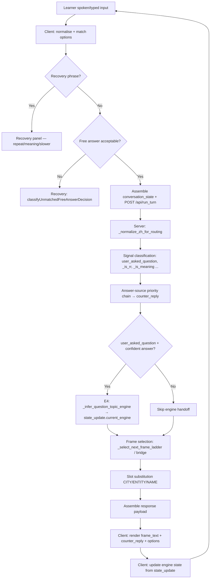

# MandarinOS Conversation Architecture

---

## 1. Purpose and scope

This document describes the conversation architecture of MandarinOS at baseline commit
`53584cee9e8c892ff77f12741d1fc89d9d09c7e7`, tagged `architecture-baseline-2026-07-12`.

It covers:

- how a learner utterance moves from spoken or typed input to a rendered partner response;
- which subsystems own which decisions;
- how topic engines, direct persona answers, recovery, and state interact;
- the invariants that future changes must preserve;
- safe extension points and known risks.

It deliberately leaves field-by-field state definitions to `STATE_CONTRACT.md` (not yet
created), detailed answer-source resolution rules to `ANSWER_SOURCE_CONTRACT.md` (not yet
created), and browser speech-recognition timing to `ASR_PIPELINE.md` (not yet created).

**MandarinOS is a conversation simulator, not a vocabulary drill or generic chatbot.**
The learner practises Mandarin by having a natural spoken or typed conversation with a
Chinese partner persona. The conversation itself is the principal unit of learner practice.
Every design decision in this document serves conversational coherence, learner initiative,
and Chinese–English fidelity before it serves any secondary concern.

---

## 2. Architectural objectives

The system is designed to achieve the following goals simultaneously:

**Sustain coherent conversation.** The partner's questions must feel like a genuine
unscripted exchange, not a fixed interview. The system selects questions that follow
naturally from what has just been said.

**Follow the learner's expressed topic or question.** When the learner asks the partner a
direct question, the partner answers it, and the next conversation move stays on that topic
rather than snapping back to a previously interrupted engine.

**Maintain gentle topic-engine progression.** When the learner is not directing the topic,
the system advances through a soft-ordered sequence of conversation frames inside a topic
engine (identity → place → work → hobby → travel → food → family). Progression is
*guidance*, not a rigid script.

**Allow direct persona questions without losing continuity.** The learner may ask the
partner anything at any time. A direct question must receive a first-person persona answer
and must not discard the current conversation position in a way that makes the next question
incoherent.

**Support recovery and clarification.** When the learner signals that they did not
understand, the system provides a recovery path (repeat, simplify, explain meaning) without
advancing the conversation topic or abandoning the practice value of the turn.

**Prevent stale or repeated answers.** The same persona answer must not be given for the
same question twice in a session. When an answer has been used, the system re-picks from
the same answer pool or provides a topically appropriate acknowledgement.

**Maintain Chinese, pinyin, and English synchronisation.** The three representations
displayed to the learner must always describe the same answer. English and pinyin are
derived from the same Chinese text, not from a coarse intent label.

**Keep answer selection, state progression, and UI presentation distinguishable.**
What the partner says, where the conversation is positioned, and how the UI displays the
result are three separate concerns.

Separation of genuine architectural objectives from feature details: the above are
objectives; the specific topic engines, persona profiles, and frame content are feature
details that can change independently.

---

## 3. End-to-end conversation flow

Each conversation turn follows this path from learner input to rendered response.

### 3.1 Numbered flow

1. **Spoken or typed learner input.** The learner speaks (via the browser SpeechRecognition
   API, language `zh-CN`) or types Chinese text. Spoken input produces a transcript in
   `ui/app.js:listenForResponse`. Typed or translated input is submitted by the learner
   directly.

2. **Client-side input normalisation and filler detection.** The client calls
   `normalizeConversationalFillers()` and `normalizeForMatch()` to strip leading discourse
   particles from the transcript before matching. `isIncompleteLearnerUtterance()` guards
   against premature submission of very short or filler-only text.

3. **Client-side option matching.** The client tries to match the transcript against the
   visible options using `matchTranscriptToOption()` (exact and partial-match).
   `classifyUnmatchedFreeAnswerDecision()` decides what to do when no option matches: accept
   the free answer, trigger recovery, or hold for another attempt.

4. **Recovery and special-intent detection on the client.** Before routing the answer to the
   server, `computeRecoveryTriggerContext()` checks whether the transcript is a recovery
   request (嗯？ 什么？ 再说一遍 etc.). If so, the client simulates a recovery panel tap
   rather than sending the utterance as a content answer.

5. **Payload assembly and API call.** The client assembles `conversation_state` (current
   engine, recent frame IDs, exchange counts, curiosity depth, last answer, recent persona
   replies, and approximately 40 additional counters and flags) and posts it to
   `/api/run_turn` with `next_question: true`. Frame-only loads (from the dropdown) send
   `frame_id` and `engine_id` instead.

6. **Server-side input normalisation.** The server calls `_normalize_zh_for_routing()`,
   which strips leading fillers via `_strip_leading_fillers()`, collapses inter-character
   CJK spaces (to handle ASR-spaced output like "西 安"), and strips trailing filler
   particles. The normalised text is used for routing; the original transcript is preserved
   separately for display and memory capture.

7. **Diagnostic capture (behaviour-free).** When diagnostics are enabled and the client
   provides a `diag_trace_id`, the server populates `_diag_cap` with routing signals
   (normalised text, intent flags, engine, answer fields). This never alters routing.

8. **Direction and probe fast-paths.** `direction_intent` values (reverse, why, mirror)
   and `probe_id` requests are handled before the main routing logic. They produce a
   short partner stub and return immediately without advancing the conversation ladder.

9. **Learner memory capture.** The server loads `learner_memory` (via `_lm_load`) for the
   current `learner_id` and applies any updates extracted from the previous turn's answer
   via `_capture_from_turn()`. Updated memory is written back via `_lm_save()`.

10. **Signal classification.** From the learner's answer, the server derives:
    `user_asked_question` (via `_is_user_question()`), `_responsive_food_answer`,
    `_is_meaning`, `_is_example`, `_is_rr` (repeat/slower request), `_lex_ct` (lexical
    definition), and whether the answer is a confusion signal or plain affirmation.

11. **Answer-source selection (priority chain).** The server works through a
    priority-ordered chain to produce `counter_reply` (the partner's response to the
    learner's previous answer). See Section 9 for the full chain. The result is the
    `counter_reply` field in the response, separated from the next frame question.

12. **E4 Initiative Follow (engine handoff).** When the learner asked a question and a
    confident non-generic answer was produced, `_infer_question_topic_engine()` classifies
    the question text and `_QUESTION_TOPIC_TO_ENGINE` maps it to a conversation engine.
    This engine is written into `state_update.current_engine` so the next frame stays on
    the redirected topic.

13. **Frame selection.** The server selects the next conversation frame via
    `_select_next_frame_ladder()` or `_select_next_frame_bridge()`. The selector respects
    `_FRAME_ORDER`, `_FRAME_AFTER` dependencies, `skip_when` conditions, recent-frame
    deduplication, interest level, and session-arc state.

14. **Slot substitution.** Frame text tokens such as `{CITY}`, `{HOMETOWN}`, `{NAME}`, and
    `{ENTITY}` are resolved from learner memory, conversation state, and the entity
    follow-up chain (EFC). Unresolved tokens fall back to context-appropriate deictic
    Chinese (那儿, 你那儿, etc.) rather than surfacing the raw placeholder.

15. **Response payload construction.** The server assembles the response dict:
    `frame_text`, `frame_pinyin`, `frame_text_en` (the next frame question),
    `counter_reply`, `counter_reply_pinyin`, `counter_reply_en` (the partner's reply to
    this turn), `engine_id`, `frame_id`, `options`, `state_update`, and optional extras
    (turn_type, diag, discovery panel data). The `counter_reply` and `frame_text` are
    entirely independent fields.

16. **Chinese–pinyin–English presentation.** The client receives the response and renders
    the partner's counter-reply and next question with their pinyin and English. The
    `frame_text_en` and `counter_reply_en` are always derived from the final Chinese text
    on the server; the client does not independently translate or gloss these fields.

17. **State updates.** The client applies `state_update` fields to its local state
    variables (`window._currentEngineId`, etc.) and records the new frame in
    `window._recentFrameIds`. These updated values are round-tripped in the next call's
    `conversation_state`.

18. **Diagnostics flush.** If a `diag_trace_id` was used, `AsrDiag.complete()` joins the
    server-side `diag` payload to the client-side ASR trace and flushes it.

### 3.2 Mermaid flowchart

The following diagram represents the main conversational branching. Minor branches
(probe, direction fast-paths) are omitted for clarity.

---

## 4. Conversation control layers

MandarinOS has the following major layers. Each is described by its authority over a
specific class of decision.

### 4.1 Browser / client interaction layer (`ui/app.js`, ~10,700 lines)

**Authoritative for:** whether a spoken or typed learner utterance is complete enough to
send; whether it matches a visible option or should be treated as a free answer; recovery
intercept; TTS playback; transcript and UI rendering; round-tripping `conversation_state`.

**Does not own:** which engine is active; what the partner says; which facts the persona
knows. These are server decisions.

**Current implementation characteristic (maintenance risk):** `ui/app.js` is approximately
10,700 lines containing all client-side logic including ASR handling, option rendering,
transcript management, card panel logic, progress display, and session management. This
concentration increases the risk of accidental coupling between unrelated concerns.

### 4.2 Server conversation coordinator (`scripts/ui_server.py`, ~12,600 lines)

**Authoritative for:** all conversation routing decisions; answer-source selection; topic
engine progression; E4 engine handoff; learner memory persistence; persona answer
derivation; slot substitution; diagnostics recording.

**Current implementation characteristic (maintenance risk):** `scripts/ui_server.py` is a
single Python file containing approximately 200 top-level functions and all server
conversation logic, from the HTTP handler through frame selection, answer-source chain,
memory management, and scorecard computation. This is the primary maintenance risk in the
codebase. Adding a new feature requires reading a large function body to understand context;
unintended interactions between branches are possible without full comprehension.

### 4.3 Question/topic inference layer (`_normalize_zh_for_routing`, `_is_user_question`, `_is_direct_persona_question`, `_infer_question_topic_engine`)

**Authoritative for:** classifying what the learner meant — answer, question, confusion,
recovery — and which engine/topic the question belongs to.

**Key contracts:** `_normalize_zh_for_routing` must run before any intent classifier;
`_is_user_question` must be called on the normalised routing text, not the raw transcript.

### 4.4 Topic engines (`_FRAME_ORDER`, `_select_next_frame_ladder`, `_select_next_frame_bridge`)

**Authoritative for:** which frame is asked next within an engine; when to bridge between
engines; how to respect FRAME_ORDER soft ordering.

### 4.5 Answer-source mechanisms (`_direct_persona_answer`, `_find_mirror_answer`, `_answer_from_working_memory`, `_confusion_recovery_reply`, `_meaning_recovery_reply`)

**Authoritative for:** what the partner says in response to the learner's current turn.
These functions are called in a fixed priority order; each returns a `(zh, en)` tuple or
`None`.

### 4.6 Memory and state (`learner_memory.py`, `conversation_state`)

**Authoritative for:** what the system knows about the learner across sessions (learner
memory) and within the current session (conversation state). See Section 10.

### 4.7 Content / persona data (`personas/jianguo.json`, `content/recovery_phrases.json`, `p2_frames.json`)

**Authoritative for:** the actual Chinese sentences the persona says; persona profile facts;
recovery phrase options; frame text and options. These files are the source of truth for
content; production code must never embed Chinese content as string literals.

### 4.8 UI rendering (`renderOptions`, `renderSentenceOptions`, `renderRecoveryPanelInto`, `tokenizeHanziForOption`)

**Authoritative for:** producing the interactive `div.option-panel` elements with speaker
button, hint button, and clickable tokens. All learner-facing response UI must use these
canonical builders.

### 4.9 Diagnostics (`_diag_enabled`, `_diag_append`, `_diag_finalize_response`, `AsrDiag`)

**Authoritative for:** capturing routing signals without altering conversation behaviour.
Diagnostics are gated by `_diag_enabled()` and must never change a routing outcome.

---

## 5. Topic engines and ladder progression

### 5.1 What an engine represents

A topic engine is a named conversational domain. Each engine owns a set of frames
(partner questions) that explore one area of the partner's life. The baseline engines are:

| Engine | Conversational purpose | Typical `_FRAME_ORDER` progression | Important handoffs |
|--------|------------------------|------------------------------------|--------------------|
| identity | Name, nickname, age | name → friends call → family call → name story → age | Bridges to place after name established |
| place | Origin, current city, local features and food | origin → current city → distance → special → food → distance-time → hometown → travel bridge → live-with → why-live | Bridges to travel after place exhausted |
| work | Occupation, company, tenure | what work → company → duration → location → origin story → future → why quit | Can bridge to hobby |
| hobby | Leisure activities | open → location → best part → origin → social → travel | Can bridge to travel |
| travel | Past travel, destinations | where been → best trip → special → food → who with → purpose | Bridges to food |
| food | Food preferences, local dishes | available → famous → taste | Exits quickly to place or travel |
| family | Living arrangement, relationships, marriage | live together → closest → activity → married → children | N/A |
| life | General lifestyle (no frames defined in baseline) | — | — |

### 5.2 `_FRAME_ORDER` is a soft preference, not a rigid script

`_FRAME_ORDER` lists the preferred sequence of frame IDs per engine. The selector respects
this order but can skip frames whose `_FRAME_AFTER` dependencies are not yet satisfied,
whose `skip_when` conditions are met, or which have already been used in `recent_frame_ids`.
The architectural contract is: the selector must produce a frame that has not been recently
used and whose pre-conditions are satisfied. The order within `_FRAME_ORDER` is a secondary
preference applied as a stable sort.

### 5.3 How the current position is retained

The client maintains `window._currentEngineId` and `window._recentFrameIds`. These are
included in every `conversation_state` payload. The server reads `cs["current_engine"]` and
`cs["recent_frame_ids"]` to determine where the conversation is positioned before selecting
the next frame.

### 5.4 Learner initiative interrupts progression

When the learner asks a direct question, E4 (Section 8) updates `state_update.current_engine`
in the response. The client applies this update, so the *next* call's `conversation_state`
carries the redirected engine. Progression then continues from the new engine rather than
reverting to the interrupted one.

### 5.5 Bridge transitions

`_select_next_frame_bridge()` fires when the current engine has no remaining frames or the
session arc state (`loop_count_in_current_engine >= LOOP_COUNT_IN_ENGINE_SOFT_CAP`)
suggests the engine is exhausted. The bridge selects a natural next engine from the
`engines_visited` history, respecting coherence conditions and seeded engine preferences.

### 5.6 Engine exhaustion and fallback

When no suitable frame can be found in any engine, the selector falls back to a safe
conversational close or a generic acknowledgement. The system must not produce an empty
frame text in production.

---

## 6. Learner initiative and question handling

MandarinOS distinguishes the following input types. The distinction is made primarily in
`scripts/ui_server.py` on the normalised routing text.

**Answer to the persona's question.** The default interpretation: the learner's text is
treated as content for the current frame. `user_asked_question` is `False`; the answer
is processed for memory capture and topic continuation.

**Learner asking the persona a direct question** (`_is_direct_persona_question`). The
learner is asking a specific fact about the partner (你是哪里人？ 你做什么工作？). This
sets `user_asked_question = True`. The server routes to `_direct_persona_answer()` or the
mirror bank.

**Reverse question** (`_detect_reverse_fact_intent`). The learner asks a question that
mirrors a topic just discussed (e.g., the persona just revealed its hometown and the learner
asks "你那里有什么好吃的？"). The server uses `_reverse_fact_answer()` to answer from the
persona's discoverable facts.

**Learner introducing a new topic** (`_is_explicit_topic_switch`, `_has_volunteered_travel_intent`). The learner volunteers information about their own travel, food, or other
topic that has not been asked about yet. The server acknowledges with an empathetic or
follow-up reply.

**Recovery request** (`_is_rr`, `_is_meaning`, confusion signal). The learner signals they
did not understand. The system provides a repeat, simplification, or meaning explanation
without advancing the conversation. Detailed in Section 12.

**Short acknowledgement** (`_is_plain_affirmation`). The learner says 对, 嗯, 是的, etc.
These clear confusion counters but do not trigger topic change.

**Ambiguous utterance.** When none of the above classifiers fire, the utterance is treated
as a content answer. The system is intentionally permissive: ambiguous input is better
received as an imperfect answer than rejected.

**Open-world fact or entity not in a fixed map** (`_extract_open_world_location`,
`_is_unscripted_substantive_answer`). The learner mentions a place, food, or name not in
the known vocabularies. The server accepts it, stores it if learner memory capture fires,
and replies naturally.

### 6.1 Question-focus precedence

**Architectural contract:** the grammatical focus of the learner's question must not be
displaced merely because another recognised entity appears earlier in the utterance.

This invariant is enforced by `_place_from_question_context()` in
`scripts/ui_server.py`. The function uses `_CITY_BEFORE_QUESTION_MARKER_RE`, a regex that
matches a city token *immediately preceding* a feature or food question marker. This
city takes priority over any other city found earlier in the utterance via
`_context_city_from_text()`.

**Illustrative example.** The learner says "我不喜欢上海，成都有什么特别？". The
utterance contains 上海 before 成都. Without the question-focus rule, the system might
answer with a Shanghai fact. The regex `_CITY_BEFORE_QUESTION_MARKER_RE` matches 成都
immediately before 有什么特别, so 成都 is the resolved subject and the answer is about
Chengdu. This was confirmed by `test_conversation_first_wave.py::test_city_routing_prefers_question_focus`.

---

## 7. Direct persona answers

### 7.1 When the direct path is invoked

`_direct_persona_answer()` is called when the learner's utterance is classified as a direct
question to the partner (`_is_direct_persona_question()` returns True, or the utterance
matches specific place-feature or place-food patterns). It is also called from within the
priority chain when a stale counter-reply override or explicit-place-topic block fires.

### 7.2 How question intent is inferred

The function `_direct_persona_answer(t, persona, recent_replies)` works by sequential
pattern matching on normalised text `t`. Patterns are ordered by specificity: longer or
more specific patterns are checked first to prevent shorter patterns from swallowing them.
For example, "你的名字有什么意思" is checked before "你的名字" to ensure the meaning
question is not mis-routed as a generic name question.

### 7.3 How persona facts are selected

The partner persona is loaded from `personas/jianguo.json` (or another persona JSON). The
function reads from:

- `persona["profile"]` — structured fields (city, hometown, age, occupation, etc.);
- `persona["voice_lines"]` — short first-person statements by topic (identity, family, work, etc.);
- `persona["discoverable_facts"]` — longer narrative facts keyed by topic ID (travel_where, food, hobby, etc.);
- `persona["distance_profile"]` — structured distance facts used by distance questions.

Facts are assembled into first-person Chinese responses dynamically. The function never
returns a Chinese literal string embedded in Python; it always derives answers from the
persona JSON.

### 7.4 How direct answers differ from ordinary ladder replies

An ordinary ladder reply is a frame selected from `p2_frames.json`: the partner *asks*
the learner a question. A direct persona answer is the partner *responding* to the learner's
question about the partner. The direct answer appears in `counter_reply`, not in
`frame_text`. The two fields are assembled and returned independently in the same response
payload.

### 7.5 Dynamic facts and predefined voice lines

When a specific fact is available in `persona["discoverable_facts"]`, the dynamic fact is
used. When no specific fact exists, the function falls back to the matching entry in
`persona["voice_lines"]`, which is a shorter general statement. When neither exists, a
generic fallback is produced (e.g., "我觉得挺不错的。"). This three-level fallback is
an architectural pattern: specificity first, voice line second, generic last.

### 7.6 How unsupported questions are handled

`_topic_aware_honest_fallback()` returns a topically-appropriate honest acknowledgement
for questions the persona cannot specifically answer. `_persona_limitation_reply()` handles
genuine out-of-scope questions. The system avoids the generic "computer character" disclaimer
unless no topic-appropriate response is available.

### 7.7 Reconnecting to conversational progression

After a direct persona answer, the next frame is selected by the normal frame selector.
If E4 fired (Section 8), the frame selector uses the redirected engine, so the next question
is on-topic relative to what the learner just asked. If E4 did not fire (generic deflection),
the frame selector continues from the interrupted engine.

---

## 8. E4 topic handoff

### 8.1 What E4 solves

When a learner asks the partner a direct question, the partner answers it. Without further
action, the next turn's frame selector would continue from whatever engine was active *before*
the learner asked. This creates an incoherent experience: the learner asks about the
partner's travel history, the partner answers, and then the *next* question is about the
partner's name — because the conversation was in the identity engine at the time.

E4 (internal architecture label: "Initiative Follow") solves this by transferring
conversational control to the engine that corresponds to the topic the learner just asked
about. "E4" is an internal label, not a class or file. It refers to the initiative-follow
handoff block in the `/api/run_turn` handler at line 10288 of `scripts/ui_server.py`.

### 8.2 Triggering conditions

E4 fires when all of the following are true:

1. The learner asked a question (`user_asked_question = True`).
2. A confident non-generic answer was produced (`_counter_result` is not None).
3. The answer came via one of the three supported paths:
   - **Mirror bank** (`_counter_is_new_mirror = True`): the question matched a known mirror topic;
   - **Working memory** (`_counter_is_working_memory = True`): the answer came from recent
     persona replies via `_answer_from_working_memory()`;
   - **Direct persona / static fact**: the answer came from `_direct_persona_answer()` and
     the resulting text is not in the generic deflection phrase set.

### 8.3 How it identifies the implied engine

For mirror-bank answers: the mirror entry carries an explicit `topic` field; the topic is
mapped to an engine via `_QUESTION_TOPIC_TO_ENGINE`.

For working memory and direct-persona answers: `_infer_question_topic_engine()` classifies
the question text using keyword matching and pattern priority (place-feature/food questions
→ place; cooking questions → food; travel keywords → travel; etc.).

### 8.4 How it transfers conversational control

E4 writes the resolved engine into `response["state_update"]["current_engine"]`. The client
applies this update to `window._currentEngineId`. On the next call, `conversation_state`
carries the new engine. The frame selector then picks from the correct engine's `_FRAME_ORDER`.

### 8.5 What state it changes and must preserve

E4 changes only `current_engine` in `state_update`. It does not touch `recent_frame_ids`,
`recent_persona_replies`, learner memory, or any counter. The conversation history is
preserved.

### 8.6 What would break without E4

Without E4, every learner-initiated question would be answered and then ignored: the next
frame would continue the interrupted engine as if the question had never been asked. The
learner's topic redirection would have no effect on subsequent partner questions, making the
system feel unresponsive to learner initiative.

---

## 9. Answer generation versus conversation progression

### 9.1 The separation

The server response contains two structurally independent parts:

- **`counter_reply` / `counter_reply_pinyin` / `counter_reply_en`**: what the partner says
  *in response to the learner's current answer*. This is generated from the answer-source
  priority chain.

- **`frame_text` / `frame_pinyin` / `frame_text_en` / `options`**: the partner's *next
  question or statement* that continues the conversation. This is selected by the frame
  selector independently of the counter-reply.

These two fields are never generated from the same code path. A developer modifying how
the partner answers direct questions does not affect frame selection, and vice versa.

### 9.2 The answer-source priority chain

The following chain is executed in order; the first non-None result becomes `counter_reply`.

1. **Frustration / insult signal** → `_frustration_repair_reply()` (social repair, no
   positive acknowledgement).
2. **Learner disclosure** (health or concern situation) → `_disclosure_empathy_reply()`.
3. **Persona challenge** (learner tests the persona's Chinese knowledge) →
   `_persona_challenge_reply()`.
4. **Responsive food answer** (declarative food-list reply to a preceding place-food
   question) → `_food_responsive_reply()`.
5. **Volunteered travel intent** (learner announces travel plans) →
   `_travel_intent_followup()`.
6. **Explicit place-topic** (learner asked a feature or food question about a named place)
   → `_direct_persona_answer()` with the place question.
7. **Meaning request** (`_is_meaning`) → `_meaning_recovery_reply()`.
8. **Example request** (`_is_example`) → `_clarify_app_question()`.
9. **Repeat / slower request** (`_is_rr`) → `_clarify_app_question()`.
10. **Lexical definition** (`_lex_ct`) → `_lexical_definition_reply()`.
11. **Stale counter-reply override** (fresh direct persona question after a previous
    counter-reply exists) → `_direct_persona_answer()` called directly (bypassing the mirror
    bank to prevent recycling an earlier city/place answer).
12. **Mirror confusion escalation** (confusion signal on an active mirror topic):
    - Stage 1 → `_mirror_restate_naturally()`;
    - Stage 2 → `_mirror_persona_stub_simple()`;
    - Stage 3+ → `_confusion_recovery_reply()`.
13. **App-question confusion** (confusion signal with no prior counter-reply) →
    `_clarify_app_question()`.
14. **Noisy location answer** (location frame but answer looks garbled) → flag only;
    frame override applied later.
15. **Pending-frame commitment** (off-topic answer to a commitment frame) →
    `_clarify_app_question()`.
16. **Adjacency guard** (learner asks "why do you like X?" when a mirror engine is active)
    → voice line fragment.
17. **E3 working memory** (learner asked a question; recent persona replies contain the
    relevant fact) → `_answer_from_working_memory()`.
18. **Mirror bank + general answer** → `_answer_user_question_prefix()` which calls
    `_find_mirror_answer()` then `_direct_persona_answer()`.
19. **`None`** — no counter-reply this turn; the frame question drives the next turn.

### 9.3 `frame_id` and ladder position

`frame_id` identifies which frame was selected as the next question. It is included in
the response so the client can update `window._lastPartnerFrameId` and append it to
`window._recentFrameIds`. These values are essential for deduplication in subsequent calls.

### 9.4 Relationship to `ANSWER_SOURCE_CONTRACT.md`

The full field-by-field definition of how each answer-source path constructs its `(zh, en)`
tuple, including which persona fields take precedence, is left to `ANSWER_SOURCE_CONTRACT.md`
(not yet created). This document establishes the boundary: `counter_reply` and `frame_text`
are always distinct; each has a single responsible code path.

---

## 10. Memory and conversational context

MandarinOS maintains four distinct context scopes.

### 10.1 Immediate turn context

Information extracted from the current request payload only: the current answer text, the
normalised routing text, the inferred intent flags. These values are computed fresh each
turn from the `payload` and are never stored.

### 10.2 Working memory (`recent_persona_replies`, `last_counter_reply`, `last_partner_frame_text`)

Working memory is a short list (up to five entries) of recent partner replies, maintained
as `cs["recent_persona_replies"]` in `conversation_state`. It is read on each turn to:

- provide context for `_answer_from_working_memory()` (E3);
- suppress exact-repeat persona answers in the deduplication guard;
- support confusion escalation (mirror confusion ladder).

Working memory is client-maintained (included in `conversation_state`) and server-read.
It is not persisted across sessions and is cleared on `startFreshLearner()`.

### 10.3 Persistent learner memory (`learner_memory.py`)

The server stores six learner facts keyed by `learner_id`:

- `learner_name` — the learner's own name;
- `hometown` — where the learner is from;
- `lives_in` — where the learner currently lives;
- `job_or_study` — what the learner does;
- `family` — family situation;
- `favourite_food` — preferred food.

These facts are captured automatically from learner answers by `_capture_from_turn()` and
persisted to `data/learner_memory.json`. They survive across sessions and are used for
slot substitution (e.g., `{CITY}` in a frame is resolved from `lives_in`).

**Architectural distinction:** working memory is short-lived context for conversational
follow-up; learner memory is a persistent biographical profile used to personalise frame
text. They must not be conflated. The server is authoritative for learner memory; the client
never sends learner_memory in its payload.

### 10.4 Persona facts (`personas/jianguo.json`)

The partner persona's facts are static JSON: `profile`, `voice_lines`, `discoverable_facts`,
`discoverable_facts_en`, `voice_lines_en`, and `distance_profile`. These are loaded at
request time by `_resolve_persona()`. They are the partner's side of the conversation; they
are not learner data.

### 10.5 Current topic / engine state

`conversation_state` carries `current_engine`, `loop_count_in_current_engine`,
`engines_visited`, `seeded_bridge_engines`, and similar fields that track where the
conversation is in its arc. These are client-maintained and server-read; the server may
update them in `state_update`.

### 10.6 Examples

| Scope | Example fact | Lifetime |
|-------|-------------|---------|
| Immediate turn | Learner said "我住在成都" | One turn only |
| Working memory | Partner said "我去过西藏" three turns ago | Current session |
| Learner memory | Learner's hometown is Dunedin | All future sessions |
| Persona facts | Jianguo's favourite food is 麻婆豆腐 | Static; changed by editing the JSON |
| Engine state | Current engine is "travel" | Current session; updated by E4 or bridge |

---

## 11. Repetition, deduplication, and stale-answer prevention

### 11.1 Reply-text deduplication

Before returning a `counter_reply`, the server checks whether the candidate text (or its
bare form after stripping the discourse prefix "我呢，") appears in `recent_persona_replies`
or matches `last_counter_reply`. This check is performed in the deduplication guard at
line 10351 of `scripts/ui_server.py`.

If the candidate is stale, `_dedupe_persona_answer()` attempts to re-pick from the
*same-intent answer pool* (e.g., another feature fact for the same city). Only when that
pool is exhausted does it fall back to a topically appropriate clarification phrase. It
never selects from a different intent's pool as the first fallback, because doing so would
produce an answer about a different city or topic than the one asked.

### 11.2 Semantic stale-answer detection and answer-pool re-selection

The place-feature and place-food answer pools (`_FEAT_POOL_INLINE`, food pool) contain
multiple alternative answers per city. When the first answer is stale, the system cycles
through alternatives before giving up. This prevents the learner from receiving the same
description of Chengdu or Shanghai on every visit to the place engine. Test coverage:
`test_stale_answer_loop_regression.py`, `test_stale_counter_reply_loop.py`.

### 11.3 Stale counter-reply override

The stale-counter-reply override (priority chain step 11 in Section 9.2) prevents a prior
place or city answer from being recycled when the learner asks a different direct question.
Without this guard, `_answer_user_question_prefix` might find a keyword match in a previous
mirror answer (e.g., 西安 in a prior reply) and return the same reply for a new, different
question. The guard calls `_direct_persona_answer()` directly for fresh direct questions,
bypassing the mirror path's keyword-matching.

### 11.4 Fallback and deduplication path must preserve answer-source contracts

When deduplication falls back to a clarification phrase, the Chinese, pinyin, and English
still come from the same resolution path: `_persona_answer_en()` is called on the final
Chinese text. There is no separate English source for the fallback case.

### 11.5 Chinese and English must not become unsynchronised

**Architectural contract:** the final `counter_reply` Chinese text is the source of truth.
`counter_reply_en` must be derived from that exact Chinese text using `_persona_answer_en()`.
The resolution order in `_persona_answer_en()` is: deflection-phrase map, voice_lines_en,
reverse-fact English, discoverable_facts_en, phrase-bank. The English must correspond to
the specific city or fact answered, not to a coarse intent label.

This contract was established after a regression (first-bad commit `0177994`) where
`_reverse_fact_answer_en()` returned English for the wrong subject. Tests:
`test_zh_en_synchronisation.py`.

---

## 12. Recovery as part of conversation

Recovery is a first-class conversation capability, not an error state. When the learner
does not understand, the conversation provides repair without losing the current topic or
advancing the ladder.

### 12.1 Recovery types

**Repeat request** (`_REPEAT_REQUEST_MARKERS`): markers including 再说一遍, 请再说 signal
the learner wants the partner's last statement repeated. The server calls
`_clarify_app_question()` on `last_partner_frame_text`, which rephrases (not verbatim
repeats) the last question in simpler Chinese.

**Slower-speech request** (`_SLOWER_REQUEST_MARKERS`): markers including 慢一点, 慢慢说
are treated equivalently to repeat requests. The response is the same simplified
rephrasing.

**Meaning request** (`_MEANING_REQUEST_MARKERS`, including 什么意思, 是什么意思): the
server calls `_meaning_recovery_reply()`, which provides the English gloss of the last
frame question plus a simpler Chinese version.

**Frustration / confusion signal** (`_is_confusion_signal`, `_is_frustration_or_insult`):
handled by mirror confusion escalation (Section 9.2, steps 12–13) or
`_confusion_recovery_reply()`.

### 12.2 Recovery phrase set

The canonical learner-side recovery phrases are defined in `content/recovery_phrases.json`
(schema version 1.3). Each phrase has an `id`, `hanzi`, `pinyin`, `text_en`, `repair_kind`
(soft_hold, repeat, meaning, etc.), and `move_type` (REPAIR). The client displays these
phrases in the recovery panel when `computeRecoveryTriggerContext()` detects that the
learner is not understood, so the learner can tap a phrase without having to produce it
from memory.

### 12.3 How recovery preserves progression

Recovery responses are produced in `counter_reply` and do not change the selected
`frame_id` or update `current_engine`. The frame selector is still called normally after a
recovery turn. The effect is that the *same* frame is asked again (because it was not marked
as seen), giving the learner another chance to answer. This is the intended behaviour:
recovery keeps the learner on the same practice moment until they are ready to continue.

### 12.4 Challenge mode

In challenge mode, the `?` hint button and recovery options are hidden from the default UI.
The learner must speak or type unaided. Recovery phrases are still available via the spoken
recovery intercept on the client (`computeRecoveryTriggerContext` still fires; recovery
panel can be triggered explicitly). The server's recovery routing is unchanged in challenge
mode.

### 12.5 How recovery differs from topic routing

Recovery is classified *before* topic routing in the answer-source priority chain (steps
7–9 precede steps 11–18). A learner who says 什么意思 never reaches the mirror bank or
frame selector for that turn. This is the correct behaviour: the learner asked for
clarification, not a new topic.

---

## 13. Client/server boundary

### 13.1 Decisions owned by the client (`ui/app.js`)

- Whether a spoken utterance is complete enough to send.
- Whether a transcript matches a visible option.
- Whether the transcript is a recovery phrase (via `computeRecoveryTriggerContext`).
- Whether a free answer is acceptable (`classifyUnmatchedFreeAnswerDecision`).
- How to render partner statements, options, recovery panels, and the transcript.
- Maintaining `conversation_state` and all `window._*` variables.
- TTS playback and listening state.
- Session start, reset, and learner ID management.

### 13.2 Decisions owned by the server (`scripts/ui_server.py`)

- All answer-source selection.
- Topic engine and frame selection.
- E4 engine handoff.
- Persona fact retrieval and first-person answer generation.
- Learner memory persistence.
- Slot substitution.
- Chinese–pinyin–English derivation.
- Diagnostic trace capture.

### 13.3 What is sent across the API

The client sends a JSON payload to `/api/run_turn` containing:

- `conversation_state` — the full client-side session context (engine, frame history,
  counters, last answer, recent persona replies);
- `next_question: true` (or `frame_id` / `engine_id` for explicit frame loads);
- `persona_id` (from the learner's profile);
- `diag_trace_id` (optional; minted by AsrDiag);
- `env: "dev"` (environment tag).

The server returns:

- `frame_text`, `frame_pinyin`, `frame_text_en` — the next partner question;
- `counter_reply`, `counter_reply_pinyin`, `counter_reply_en` — the partner's response to this turn;
- `engine_id`, `frame_id`, `options`, `turn_type`;
- `state_update` — specific fields the client must update (e.g., `current_engine` after E4);
- `diag` — server-side diagnostic capture, if applicable.

### 13.4 Which client-side heuristics affect routing or display

`_detectSemanticCategory()` in `ui/app.js` categorises unmatched free text for display
purposes and to guide `classifyUnmatchedFreeAnswerDecision`. `semanticSoftMatch()` provides
a secondary relevance check. These affect only whether the client *sends* the answer to the
server, not what the server does with it. The server performs all routing on its own
normalised text.

### 13.5 Intentional duplication and verification scripts

`tests/verify_asr_filler.js` is a standalone Node.js verification script that mirrors
the key client-side routing functions (`_detectSemanticCategory`,
`classifyUnmatchedFreeAnswerDecision`, `normalizeConversationalFillers`). It exists because
these functions are embedded in `ui/app.js` and cannot be unit-tested directly by the
Python test suite.

**Maintenance implication:** whenever `_detectSemanticCategory` or
`classifyUnmatchedFreeAnswerDecision` are updated in `ui/app.js`, `verify_asr_filler.js`
must be updated to stay consistent. The script contains more than 80 assertions and is
run as part of the manual verification tier via `node tests/verify_asr_filler.js`.

The UI must never independently recreate server-side conversation logic. The boundary is
intentional: if the client appears to be making routing decisions that belong on the server,
that is a boundary violation, not an optimisation.

---

## 14. Diagnostics and observability

### 14.1 Architectural purpose

Diagnostics allow a developer or operator to observe what the system saw and decided without
changing how the system behaves. They exist to diagnose spoken-input divergence (why a
spoken answer was routed differently from its typed equivalent), routing failures, and
answer-source selection.

### 14.2 Server-side trace capture

When `_diag_enabled()` returns True and the client provides a `diag_trace_id`, the server
populates a `_diag_cap` dict with:

- the normalised and raw input texts;
- which `last_answer` field was effective (`submitted_text` vs `selected_option_hanzi`);
- intent flags (`user_asked_question`, `direct_persona_intent`, `place_feature_match`, etc.);
- `conversation_state` fields relevant to routing (`current_engine`, `last_counter_reply`,
  `last_place_subject`, `recent_persona_replies` count);
- the normalizer name (`_normalize_zh_for_routing`, exposed as `_diag_normalizer_name()`).

The `_diag_cap` is attached to the response as `data.diag` and returned to the client.

### 14.3 Client-side ASR trace

`AsrDiag` in `ui/app.js` tracks the spoken input path: when microphone input began, the
transcript, confidence, and submission path. After the server responds, `AsrDiag.complete()`
joins the server-side `diag` payload to the client-side trace and flushes it.

### 14.4 Deployed identity

The production application exposes a `/api/version` (or equivalent) endpoint that reports:

- `branch: main`;
- `sha`: the deployed commit SHA;
- `diagnostics_enabled: true`;
- `normalizer: _normalize_zh_for_routing`.

No credentials, private URLs, tokens, or environment secrets are included in any diagnostic
payload or documentation.

### 14.5 Diagnostic log messages are not architectural contracts

The exact wording of server log lines (e.g., `[ui_server] /api/run_turn payload keys=...`)
is not a contract. Log messages may be changed or removed without architectural impact.
Only the structured `diag` response field and the `/api/version` payload are intended
as stable diagnostic interfaces.

---

## 15. Invariants

The following are verified architectural invariants at the baseline. Each is supported by
code and representative tests. Where enforcement is currently incomplete, this is noted
explicitly.

**INV-1: The learner's explicit question takes precedence over routine ladder continuation.**
When `user_asked_question = True` and a confident answer is produced, E4 updates
`current_engine` to the questioned topic. The next frame is then selected from the redirected
engine. *Enforcement:* E4 block in `scripts/ui_server.py:10288`; `state_update.current_engine`
write. *Tests:* `test_e4_topic_handoff.py`.

**INV-2: The grammatical focus of a learner question must not be displaced by irrelevant
recognised entities appearing earlier in the utterance.**
`_place_from_question_context()` uses `_CITY_BEFORE_QUESTION_MARKER_RE` to prioritise the
city immediately preceding the question marker over any other city in the utterance.
*Enforcement:* `scripts/ui_server.py:_place_from_question_context`. *Tests:*
`test_conversation_first_wave.py::test_city_routing_prefers_question_focus`.

**INV-3: Direct persona answers must not leave topic progression in an incoherent state.**
E4 fires after every confident direct answer to redirect the engine. When E4 does not fire
(generic deflection), the previous engine is preserved. In both cases, the response
includes a coherent next frame. *Enforcement:* E4 gating on deflection-phrase set;
frame selector always produces a frame. *Tests:* `test_e4_topic_handoff.py::TestE4DirectPersonaHandoff`.

**INV-4: Answer text and progression state are separate concerns.**
`counter_reply` and `frame_text` are always distinct fields assembled from independent
code paths. A change to one does not affect the other. *Enforcement:* structural separation
in the `response` dict construction; no shared variable between the two paths. *Tests:*
`test_zh_en_synchronisation.py`.

**INV-5: Chinese and English must describe the same selected answer.**
`counter_reply_en` is always derived from the final `counter_reply` Chinese text via
`_persona_answer_en()`. The deduplication path calls `_persona_answer_en()` on the
*substitute* answer, not on the original intent. *Enforcement:* `_persona_answer_en()`
called on every counter-reply modification, including deduplication. *Tests:*
`test_zh_en_synchronisation.py`.

**INV-6: Working memory and persistent learner memory must not be conflated.**
`recent_persona_replies` (working memory) is round-tripped by the client within one session.
Learner memory fields (`learner_name`, `hometown`, etc.) are written only by the server via
`_lm_save()` and never sent by the client. *Enforcement:* `learner_memory.py` validates that
only keys in `LEARNER_MEMORY_KEYS` are stored; the server never reads learner_memory from
the client payload. *Tests:* `test_learner_memory_migration.py`.

**INV-7: Recovery handling must not accidentally advance the topic ladder.**
Recovery responses are placed in `counter_reply`. Frame selection is still called, but since
the recovery turn is not recorded in `recent_frame_ids` as a new frame, the same frame
is presented again. *Enforcement:* recovery branches in the priority chain set
`_counter_result` without changing `frame_id` selection logic. *Tests:*
`test_challenge_recovery.py`, `test_meaning_recovery.py`.

**INV-8: Fallback and deduplication paths must preserve answer-source and translation
contracts.**
When `_dedupe_persona_answer()` selects an alternative, it calls `_persona_answer_en()` on
the alternative Chinese text. It never returns an English string from the discarded
candidate. *Enforcement:* `_persona_answer_en()` called on `_deduped` at line 10361.
*Tests:* `test_stale_answer_loop_regression.py`.

**INV-9: Client display state must not silently redefine server conversation state.**
`window._currentEngineId` and `window._recentFrameIds` are populated only from server
responses (`data.engine_id`, `data.state_update`, `data.frame_id`). The client does not
independently decide which engine is active or which frames have been seen. *Enforcement:*
engine update logic in `ui/app.js:6240–6249` reads from `data` fields only. *Tests:*
`test_conversation_first_wave.py::test_active_turn_record_single_source_of_truth`.

---

## 16. Extension points

### 16.1 Adding a new topic engine

**Files changed:** `_FRAME_ORDER` in `scripts/ui_server.py` (add engine key and frame list);
`p2_frames.json` (add frame definitions); `_QUESTION_TOPIC_TO_ENGINE` (if the engine can
be E4-triggered); `_infer_question_topic_engine()` (add classification keywords if needed).

**Tests to add or update:** at minimum, one test confirming the new engine's frames appear
in selection output; one test confirming E4 redirects to it correctly.

**State and answer-source contracts to check:** ensure `skip_when` conditions are
declarative predicates registered in `_check_skip_condition()`; do not add `if`-blocks in
the selector for new engine names.

**Common bypass risk:** writing engine-specific logic directly in the selector rather than
as `skip_when` in the frame JSON.

### 16.2 Adding a ladder step (frame) to an existing engine

**Files changed:** `p2_frames.json` (new frame entry with `engine_id`, `frame_id`,
`frame_text`, `frame_pinyin`, `frame_text_en`, `options`, `move_type`); `_FRAME_ORDER` in
`scripts/ui_server.py` (insert at the desired position); `_FRAME_AFTER` if the frame has
a prerequisite.

**Tests to add:** one test confirming the frame appears in selection after its prerequisites
are met.

**Common bypass risk:** adding the frame without adding it to `_FRAME_ORDER`, which means
it will never be selected by the frame selector in Phase 12D mode.

### 16.3 Adding a direct persona-answer intent

**Files changed:** `_direct_persona_answer()` in `scripts/ui_server.py` (add pattern and
answer derivation); `persona["voice_lines"]` or `persona["discoverable_facts"]` in the
persona JSON (add the fact if it is persona-specific); `_QUESTION_TOPIC_TO_ENGINE` (if E4
should fire for this question type).

**Tests to add:** `test_direct_question_coverage.py` pattern; confirm E4 fires if applicable.

**Common bypass risk:** embedding a Chinese answer string directly in `_direct_persona_answer`
instead of reading it from the persona JSON. This violates the no-inline-Chinese-strings rule.

### 16.4 Adding a persona fact

**Files changed:** the persona JSON file (`personas/jianguo.json` or equivalent) — add to
`profile`, `voice_lines`, `discoverable_facts`, and/or `discoverable_facts_en` as appropriate.

**Tests to add:** confirm the fact is returned by `_direct_persona_answer()` for the
relevant question; confirm `_persona_answer_en()` returns the English equivalent.

### 16.5 Adding a recovery pattern

**Files changed:** `content/recovery_phrases.json` (new phrase entry); if a new server-side
recovery type is introduced, add to `_REPEAT_REQUEST_MARKERS`, `_SLOWER_REQUEST_MARKERS`,
or `_MEANING_REQUEST_MARKERS` in `scripts/ui_server.py`, and update `computeRecoveryTriggerContext`
in `ui/app.js`.

**Tests to add:** `test_challenge_recovery.py` pattern — confirm the marker is in the
correct tuple and that the correct recovery path is selected.

**Common bypass risk:** adding a marker only to the server tuple but not to the client
intercept, or vice versa, causing the client to route the phrase as content while the server
expects it as recovery.

### 16.6 Adding confirmed open-world entities

**Files changed:** currently the system uses `_extract_open_world_location()` for unknown
places and `_is_unscripted_substantive_answer()` for general open-world answers. Adding a
*confirmed* entity to a fixed map (e.g., a known city to `_CITY_LOCATION_BRIEF`) requires
only a content data change.

**Common bypass risk:** adding entities with inconsistent casing or romanisation that may
not match ASR output.

### 16.7 Adding a new answer source

**Files changed:** the priority chain in the `/api/run_turn` handler; a new helper function
(must return `Optional[tuple]` of `(zh, en)`); `_persona_answer_en()` if the new source
generates Chinese that needs translation.

**Tests to add:** confirm the new source fires when expected; confirm it does not fire in
exclusion cases; confirm `counter_reply_en` matches `counter_reply`.

**Common bypass risk:** inserting the new source at the wrong priority level, allowing it
to override recovery or explicit-place-topic results.

### 16.8 Deferred future pattern: unfamiliar entity confirmation

A planned future capability: when the app hears an unfamiliar name, food, city, or other
proper noun, it repeats the entity for confirmation, stores it as a fact if confirmed, and
then continues conversation.

Architecturally, this capability would connect to: `_extract_open_world_location()` (entity
extraction); `learner_memory` (persistence after confirmation); `conversation_state`
(pending confirmation flag); slot substitution (use of confirmed entity in later frames);
and the client's `classifyUnmatchedFreeAnswerDecision` (accepting the confirmation utterance
as an affirmation rather than routing it as content).

Do not design or implement this feature based on this document. It is mentioned only to
identify where it would connect.

### 16.9 Extending diagnostics

**Files changed:** `_diag_append()` or direct population of `_diag_cap` in
`scripts/ui_server.py`; `AsrDiag` methods in `ui/app.js` for client-side trace fields.

**Constraint:** diagnostic code must be gated on `_diag_enabled()` and must never alter a
routing or selection decision.

---

## 17. Known limitations and architectural risks

### 17.1 Accepted product limitations

**Spoken-Chinese ASR sensitivity** (Known limitation). The browser SpeechRecognition API's
accuracy for Mandarin Chinese varies with pronunciation, microphone quality, ambient noise,
and utterance clarity. The system normalises ASR output and repairs common
misrecognitions, but it cannot guarantee accurate transcription in all conditions. This
limitation is accepted at the baseline and is not scheduled for resolution in the near term.

### 17.2 Implementation risks

**Large single-file server** (Maintenance risk). `scripts/ui_server.py` (~12,600 lines,
~200 top-level functions) contains all server-side conversation logic in a single Python
file. Adding a new feature requires understanding a large body of code to avoid
introducing unintended interactions between the priority chain, frame selector, E4,
diagnostics, and slot substitution. Regression introduction is proportionally more likely
as the file grows.

**Large single-file client** (Maintenance risk). `ui/app.js` (~10,700 lines, ~255 top-level
functions) contains all browser-side logic including ASR, option rendering, transcript
management, card panel, progress display, and session management. The same risk applies as
for the server file.

**Logic mirrored across client, server, and verification scripts** (Maintenance risk).
`_detectSemanticCategory` and `classifyUnmatchedFreeAnswerDecision` in `ui/app.js` are
duplicated in `tests/verify_asr_filler.js` for test purposes. If the client code changes,
the verification script must also be updated. If they diverge, the test assertions will
not reflect the actual client behaviour.

**Broad fallback logic and stale-answer regressions** (Maintenance risk). The mirror bank
and reverse-fact path use keyword matching that can cross topic boundaries. A keyword
common to two topics (e.g., 做什么 matching both food and work) can cause the wrong
answer to be selected. The priority chain provides some protection, but the risk increases
as the number of facts and topics grows.

### 17.3 Deferred improvements

**Source-inspection tests** (Deferred improvement). Tests that inspect the source of
`ui/app.js` for specific formatting patterns (`test_progress_tracking.py`) are inherently
brittle and can fail when the code is reformatted. Where practical, these should be replaced
with behavioural tests.

**`scripts/ui_server.py` decomposition** (Deferred improvement). The server logic could be
decomposed into smaller modules (answer-source resolution, frame selection, memory
management, diagnostics) to reduce coupling and improve discoverability. This is not
currently planned; the risk is managed by the invariants in Section 15.

---

## 18. How to diagnose a conversation regression

Use the following sequence when a conversation behaves unexpectedly.

### 18.1 Wrong topic selected

1. Check `conversation_state.current_engine` in the request payload — is it the expected engine?
2. Check `state_update.current_engine` in the previous response — did E4 fire and set an unexpected engine?
3. Check `_FRAME_ORDER` for the active engine — is the frame that appeared expected at this position?
4. Check `skip_when` conditions on the selected frame — did a condition skip an expected frame?
5. Check `recent_frame_ids` — was the expected frame recently used and deduped?

### 18.2 Correct direct answer but wrong next question

1. Confirm E4 fired: look for `state_update.current_engine` in the response matching the expected topic.
2. If E4 did not fire: check `_infer_question_topic_engine()` against the question text — does it classify correctly?
3. If E4 fired to the wrong engine: check `_QUESTION_TOPIC_TO_ENGINE` for the mirror topic.
4. Check `_FRAME_ORDER` for the E4 engine — the first available unseen frame in that order should have been selected.

### 18.3 Repeated persona answer

1. Check `recent_persona_replies` in `conversation_state` — is the repeated answer already in the list?
2. Check `_dedupe_persona_answer()`: is the same-intent answer pool exhausted?
3. Check whether `_persona_answer_en()` was called on the substitute answer (not the original).

### 18.4 Chinese and English mismatch

1. Confirm `counter_reply` and `counter_reply_en` in the response.
2. Trace `_persona_answer_en()` with the Chinese text — which branch did it take?
3. Check `voice_lines_en`, `discoverable_facts_en`, and the deflection-phrase map for missing entries.

### 18.5 Ladder fails to advance

1. Check `recent_frame_ids` — are all frames in `_FRAME_ORDER` already there?
2. Check `_FRAME_AFTER` dependencies — are pre-conditions met?
3. Check `skip_when` predicates — is the expected frame always skipping?
4. Check whether a bridge should have fired instead of ladder.

### 18.6 Learner question ignored

1. Check `user_asked_question` in the diagnostic capture — did the classifier return True?
2. If False: check `_is_user_question()` on the normalised text — does it miss the question pattern?
3. Check `_responsive_food_answer` — did the food-answer override suppress the question classification?
4. If `user_asked_question` is True but no answer was produced: check whether the answer-source priority chain returned None for all steps.

### 18.7 Recovery phrase treated as content

1. Confirm whether the client's `computeRecoveryTriggerContext()` fired — check if the recovery panel was shown.
2. On the server: check `_is_rr`, `_is_meaning`, `_is_confusion_signal` against the normalised text.
3. Check whether the phrase appears in `_REPEAT_REQUEST_MARKERS`, `_SLOWER_REQUEST_MARKERS`, or `_MEANING_REQUEST_MARKERS`.

### 18.8 Client and server disagree about state

1. Compare `conversation_state` in the outgoing request with `state_update` in the previous response — was `state_update` applied correctly?
2. Check `window._currentEngineId` in browser devtools against `cs.current_engine` in the network payload.
3. Check `window._recentFrameIds` against `cs.recent_frame_ids` — are frames being added correctly?

---

## 19. Related documents

The following documents are part of the MandarinOS architecture documentation programme.
Links marked "(not yet created)" will resolve once the relevant document is authored.

- `docs/STATE_CONTRACT.md` — (not yet created) Field-by-field definition of `conversation_state`, `state_update`, and `learner_memory` schemas. The authoritative reference for what each field means and who owns it.
- `docs/ANSWER_SOURCE_CONTRACT.md` — (not yet created) Detailed contract for how each answer-source path (`_direct_persona_answer`, `_find_mirror_answer`, `_answer_from_working_memory`, etc.) constructs its `(zh, en)` tuple and which persona data fields take precedence.
- `docs/ASR_PIPELINE.md` — (not yet created) Browser speech-recognition lifecycle, confidence handling, ASR retry and timeout logic, interim result processing, and the `AsrDiag` trace format.
- `docs/ARCHITECTURE.md` — (not yet created) High-level repository map and system boundary overview, for orientation before reading this document.
- `docs/TEST_STRATEGY.md` — (not yet created) Test tiers (core unit/contract, local integration, manual JavaScript, deployment), pytest markers, and how to run each tier.
- `docs/CHANGE_CHECKLIST.md` — (not yet created) Per-change checklist: which files to update, which tests to run, and which invariants to verify before committing a conversation architecture change.
- `docs/ARCHITECTURAL_DECISIONS.md` — (not yet created) Record of significant architectural decisions and the evidence behind them (e.g., why E4 uses `_infer_question_topic_engine()` rather than the mirror topic directly for the working-memory path).
- `docs/PRODUCT_PHILOSOPHY.md` — (not yet created) Why MandarinOS is a conversation simulator rather than a vocabulary drill; how the product decisions shaped the architectural constraints.
- `docs/AGENTS.md` — (not yet created) Agent and automation guidance for contributors using AI tooling with this repository.

---

## Appendix A — Traceability

### A.1 Principal implementation locations by architectural area

| Architectural area | Primary implementation locations | Representative tests |
|--------------------|----------------------------------|----------------------|
| Input normalisation | `scripts/ui_server.py:_normalize_zh_for_routing`, `_strip_leading_fillers` | `test_asr_filler_suppression.py` |
| Client intent matching | `ui/app.js:classifyUnmatchedFreeAnswerDecision`, `matchTranscriptToOption` | `tests/verify_asr_filler.js` |
| Recovery detection | `ui/app.js:computeRecoveryTriggerContext`; `scripts/ui_server.py:_is_rr`, `_is_meaning`, `_REPEAT_REQUEST_MARKERS` | `test_challenge_recovery.py`, `test_meaning_recovery.py` |
| Topic engine selection | `scripts/ui_server.py:_select_next_frame_ladder`, `_select_next_frame_bridge`, `_FRAME_ORDER` | `test_conversation_first_wave.py` |
| Question routing | `scripts/ui_server.py:_is_user_question`, `_is_direct_persona_question`, `_is_place_feature_question`, `_is_place_food_question` | `test_spoken_question_routing_regression.py`, `test_direct_question_coverage.py` |
| Question-focus precedence | `scripts/ui_server.py:_place_from_question_context`, `_CITY_BEFORE_QUESTION_MARKER_RE` | `test_conversation_first_wave.py::test_city_routing_prefers_question_focus` |
| Answer-source chain | `scripts/ui_server.py:/api/run_turn handler (L9896–10288)` | `test_stale_counter_reply_loop.py`, `test_stale_answer_loop_regression.py` |
| Direct persona answers | `scripts/ui_server.py:_direct_persona_answer`, `_reverse_fact_answer` | `test_regression_surgical_transcript.py`, `test_direct_question_coverage.py` |
| E4 initiative follow | `scripts/ui_server.py:E4 block (L10288)`, `_infer_question_topic_engine`, `_QUESTION_TOPIC_TO_ENGINE` | `test_e4_topic_handoff.py` |
| Zh–En synchronisation | `scripts/ui_server.py:_persona_answer_en`, `_voice_line_en_for_zh`, `_en_for_counter_reply` | `test_zh_en_synchronisation.py` |
| Stale-answer prevention | `scripts/ui_server.py:_dedupe_persona_answer`, dedup guard (L10351) | `test_stale_answer_loop_regression.py`, `test_stale_counter_reply_loop.py` |
| Working memory (E3) | `scripts/ui_server.py:_answer_from_working_memory`, `_extract_persona_facts_from_recent` | `test_conversation_first_wave.py` |
| Learner memory | `scripts/learner_memory.py`, `scripts/learner_memory_capture.py` | `test_learner_memory_migration.py`, `test_clear_memory_regression.py` |
| Open-card resolution | `runtime/open_card_resolver.py`, `runtime/engine.py`, `runtime/open_card_wiring.py` | `test_open_card_resolver.py`, `test_open_card_trace_integration.py` |
| Client/server boundary | `ui/app.js:_runTurnInner` (payload assembly); `scripts/ui_server.py:/api/run_turn` (response assembly) | `test_conversation_fixes.py`, `test_conversation_first_wave.py` |
| Diagnostics | `scripts/ui_server.py:_diag_enabled`, `_diag_append`, `_diag_finalize_response`; `ui/app.js:AsrDiag` | `test_diagnostic_engine.py` (standalone), `test_deployment_hygiene.py` |
| Recovery phrases | `content/recovery_phrases.json`; `ui/app.js:learnerRecoveryPhrases`, `selectRecoveryPhrase` | `test_recovery_deployment.py` |
| Conversation state round-trip | `ui/app.js:_runTurnInner` (conversation_state); `scripts/ui_server.py` (state_update) | `test_conversation_first_wave.py`, `test_session_start_reset.py` |

### A.2 Traceability metadata

| Field | Value |
|-------|-------|
| Baseline commit | `53584cee9e8c892ff77f12741d1fc89d9d09c7e7` |
| Baseline tag | `architecture-baseline-2026-07-12` |
| Document status | Draft v1 |
| Last verified date | 2026-07-12 |
