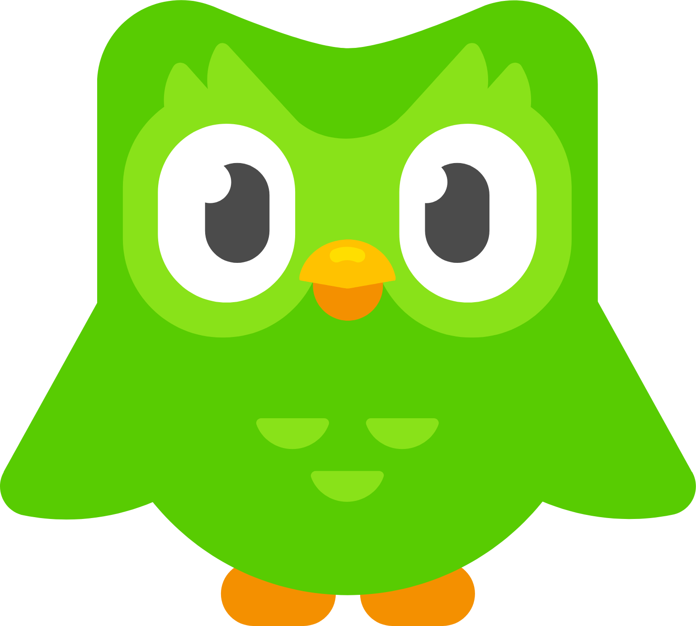

<!-- _class: center -->

MandarinOS / Pre-launch Video 1

# Imagine spending over $7,000 learning Chinese…

…and still not being able to properly hold a conversation.

---

# That’s literally me.

### My situation
- Chinese wife
- daily access to a native speaker
- years of study
- still struggle speaking

### What I expected
More exposure = easier speaking

### What actually happened
I still froze in real conversations

---

<!-- _class: center -->

what I tried

$1,700 China immersion

$2,000 coaching

$800 Mandarin Blueprint

---

# And then the apps.

 
   

Basically every serious option I could find.

---

<!-- _class: center -->

the reality

I still freeze.

One or two sentences… then my brain goes blank.

---

<!-- _class: center -->

what it feels like

Panic. Blank mind. Pressure. Then I switch back to English.

---

<!-- _class: center -->

the embarrassing part

# “Sorry, my Chinese isn’t very good.”

After all that time, money, and exposure.

---

# And I know I’m not the only one.

### So many learners…
- study for years
- know lots of vocabulary
- understand grammar
- can read basic Chinese

### But then…
- conversation starts
- speed increases
- pressure rises
- everything falls apart

---

<!-- _class: center -->

the question

How can someone spend this much time, money, and effort…

and STILL not speak?

---

# My realisation

### The problem is not:
❌ laziness
❌ lack of discipline
❌ Chinese being “too hard”

---

<!-- _class: center -->

core insight

We are being taught the wrong skill.

---

<!-- _class: center -->

close

# If this sounds like your experience…

follow me.

In the next few posts, I’ll explain why most Chinese learning methods fail intermediate learners.

